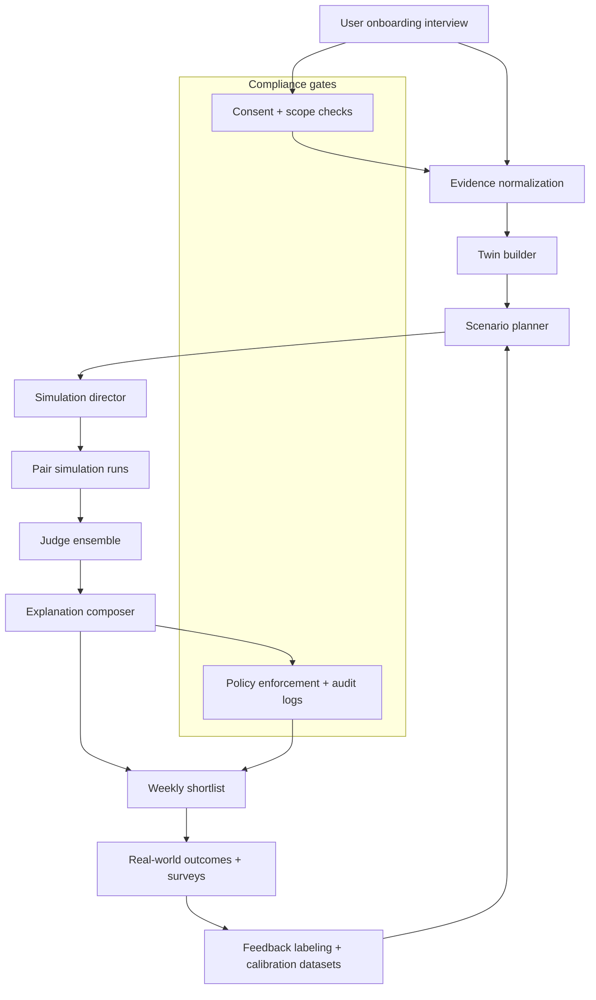
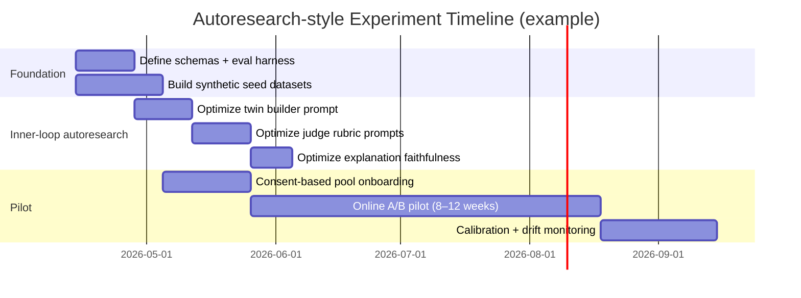

# Adapting Karpathy’s AutoResearch to Cognitive Matchmaker

## Executive summary

Karpathy’s **autoresearch** is a deliberately constrained autonomous experiment loop: an agent repeatedly proposes a change, runs a time-boxed evaluation, and **keeps** or **reverts** the change using a single scalar metric, while logging outcomes. In the reference implementation, the agent edits **one file** (`train.py`), runs training for a **fixed 5‑minute wall-clock budget**, evaluates via a fixed harness (metric `val_bpb`), and advances the branch only when the metric improves; everything else is treated as locked-down evaluation infrastructure. citeturn1view0turn3view0turn2view0

The **transferable method** is not “LLMs do research”: it is a *recipe* for making agentic iteration productive and debuggable by enforcing (a) a bounded editable surface, (b) short objective feedback loops, and (c) rigorous logging + checkpointing. These properties are explicitly singled out as favorable conditions for AutoResearch-style success in a March 2026 technical memo from entity["organization","Massachusetts Institute of Technology","cambridge, ma, us"]’s entity["organization","Center for Brains, Minds and Machines","mit research center"]. citeturn10view0

For **Cognitive Matchmaker**, the key adaptation challenge is that “true match quality” is **slow** (dates happen days/weeks later) and partially subjective. The core design move is therefore:

- Build a **fast surrogate evaluation harness** (minutes) that scores: transcript quality, inter-judge agreement, explanation faithfulness, stability across seeds, and compliance gating.
- Treat the slow real-world outcomes as **ground truth** used for periodic calibration (weekly/monthly), not for the inner loop.
- Apply the AutoResearch constraint pattern to *prompts and policies* (the “editable artifacts”), while keeping the evaluation harness fixed.

Assumptions (explicit): common cloud primitives are available (VMs, object storage, managed DB); LLM vendor/model may change; candidate pool is **consent-based**; no automated outreach without explicit mutual consent and human-in-loop gates.

## Autoresearch components mapped to Cognitive Matchmaker modules

### Mapping table

The table below maps *AutoResearch primitives* (as described in `README.md` and `program.md`) to each Cognitive Matchmaker module. citeturn1view0turn3view0turn2view0

| AutoResearch primitive | What it is in autoresearch | Onboarding | Twin builder | Scenario planner | Simulation runner | Observer / judges | Explanation composer | Feedback loop | Compliance |
|---|---|---|---|---|---|---|---|---|---|
| Bounded editable surface | Agent edits **only `train.py`**; other files + eval are read-only. citeturn1view0turn2view0 | Only `onboarding_prompt.md` varies; interview rubric locked | Only `twin_builder_prompt.md` varies; schema locked | Only `scenario_planner_prompt.md` varies; scenario catalog locked | Only `simulation_director_prompt.md` varies; runner code locked | Only `judge_prompts/*.md` vary; rubric locked | Only `explanation_prompt.md` varies; faithfulness checker locked | Only `feedback_prompt.md` varies; surveys locked | Only `policy_rules.yaml` varies; enforcement locked |
| Fixed time budget | Every run uses a **fixed 5‑minute budget**. citeturn1view0turn2view0turn3view0 | Time-box interview steps (e.g., ≤20 min) for comparable transcripts | Time-box twin build tokens/calls | Fixed number of scenarios selected per pair | Fixed `S×R` simulation budget (scenarios × repeats) | Fixed judging budget (N transcripts sampled + N judges) | Fixed explanation budget (token cap) | Fixed follow-up cadence | Fixed review gates budget |
| Single objective number | `val_bpb` is the scalar optimize target; lower is better. citeturn1view0turn3view0 | Optimize “CoverageScore” (required domains answered) | Optimize “TwinConsistencyScore” | Optimize “ScenarioInfoGainScore” | Optimize “StabilityAdjustedMatchScore” | Optimize “JudgeAgreement×Calibration” | Optimize “FaithfulExplanationScore” | Optimize “OutcomePredictionAUC” (periodic) | Optimize “PolicyPassRate” with low false negatives |
| Keep/discard ratchet | Agent commits, runs, keeps only if metric improves; otherwise resets. citeturn3view0turn2view0 | Keep prompt change only if onboarding coverage rises without safety regressions | Keep if twin stability rises and contradiction rate drops | Keep if info gain rises and cost stable | Keep if score improves with acceptable variance | Keep if agreement/calibration improve | Keep if faithfulness improves | Keep if predictive metrics improve | Keep if fewer violations at same utility |
| Reproducible setup instructions | Run tag/branch, baseline first run, locked eval harness. citeturn2view0turn3view0 | Version interview scripts and baseline coverage | Version schema + baseline twin | Version scenario templates and baseline selection | Version simulator + seeds | Version rubric + baseline thresholds | Version explanation format | Version surveys & labels | Version consent + audit policy |
| Lightweight infra | Small repo, minimal deps; encourages iteration. citeturn1view0turn2view0 | Minimal state machine + JSON logs | Pure prompt+schema artifacts | Prompt+catalog | Deterministic runner + JSONL logs | Stateless scorers | Stateless composer | Simple survey collector | Policy engine + audit log |
| Logging results table | `results.tsv` (untracked) logs commit, metric, status, description. citeturn2view0turn3view0 | `results_onboarding.tsv` | `results_twin.tsv` | `results_scenarios.tsv` | `results_sim.tsv` | `results_judges.tsv` | `results_explain.tsv` | `results_outcomes.tsv` | `results_compliance.tsv` |

### Why these constraints matter for matchmaker simulation

Two Karpathy-adjacent principles translate directly:

- Training/LLM pipelines can “fail silently” unless you lock down baselines and instrumentation; therefore you should build an end-to-end skeleton, get dumb baselines, and run explicit ablations. citeturn6view0
- Reproducibility (e.g., fixed seeds) is a sanity-preserving technique for iterative debugging. citeturn6view0

## Agent specs and prompt templates for experiments

### Global conventions for experiments

**Artifact contract (recommended):** every agent call must produce a JSON output conforming to a schema; any nonconforming output is a hard failure (“crash”), mirroring AutoResearch’s “crash” state. citeturn2view0turn3view0

**Envelope (shared across agents):**
```json
{
  "meta": {
    "run_id": "string",
    "agent_name": "string",
    "agent_version": "string",
    "timestamp_utc": "string",
    "llm_model": "string",
    "temperature": 0.2,
    "seed": 12345
  },
  "inputs": { "any": "object" },
  "outputs": { "any": "object" },
  "telemetry": {
    "token_in": 0,
    "token_out": 0,
    "latency_ms": 0,
    "cost_usd_est": 0.0
  }
}
```

Below are the **12 major agents** (from the prior plan), each with role, I/O schemas, prompt templates, guardrails, memory slices, test cases, and minimal evaluation metrics. The prompt templates are designed to be “one-file editable artifacts” so they can be optimized via an AutoResearch-style loop.

---

**Agent: Orchestrator**

**Role:** Workflow control plane. Creates run plans, schedules agents, enforces gates, and records state transitions.

**Inputs (JSON schema):**
```json
{
  "type": "object",
  "required": ["event", "state"],
  "properties": {
    "event": {
      "type": "object",
      "required": ["type", "entity_id"],
      "properties": {
        "type": { "type": "string", "enum": ["onboard_user", "ingest_candidate", "weekly_shortlist", "feedback_received", "recompute_scores"] },
        "entity_id": { "type": "string" }
      }
    },
    "state": { "type": "object" },
    "constraints": { "type": "object" }
  }
}
```

**Outputs (JSON schema):**
```json
{
  "type": "object",
  "required": ["plan", "gates"],
  "properties": {
    "plan": {
      "type": "array",
      "items": {
        "type": "object",
        "required": ["step_id", "agent", "input_ref"],
        "properties": {
          "step_id": { "type": "string" },
          "agent": { "type": "string" },
          "input_ref": { "type": "string" },
          "timeout_s": { "type": "integer" },
          "retries": { "type": "integer" }
        }
      }
    },
    "gates": {
      "type": "array",
      "items": {
        "type": "object",
        "required": ["gate_id", "condition", "on_fail"],
        "properties": {
          "gate_id": { "type": "string" },
          "condition": { "type": "string" },
          "on_fail": { "type": "string", "enum": ["halt", "human_review", "retry", "fallback"] }
        }
      }
    },
    "notes": { "type": "string" }
  }
}
```

**Prompt template (LLM):**
```text
SYSTEM: You are the Orchestrator for Cognitive Matchmaker experiments.
You must output ONLY valid JSON matching the Orchestrator output schema.

USER INPUT:
- event: {{event}}
- current_state_summary: {{state_summary}}
- policy_constraints: {{policy_constraints}}

TASK:
1) Produce an execution plan (ordered steps) using the available agents.
2) Define gates (stop conditions) with explicit on_fail actions.
3) Prefer minimal steps; avoid redundant recomputation; enforce compliance gating before any user-visible output.
```

**Guardrails:**
- No user-visible recommendations unless Compliance gate passes.
- No autonomous outreach/scheduling steps unless explicit consent flags are present in state.
- Hard-fail if any upstream artifact is missing required consent metadata.

**Required memory slices:**
- `RunRegistry` (run_id → status)
- `UserProfileIndex` / `CandidateIndex`
- `PolicyConstraints` (current)

**Test cases (minimal):**
- Missing consent record → gate to `human_review`.
- Weekly run with <N candidates → output “insufficient pool” plan.
- Upstream judge variance too high → add “increase repeats” step.

**Evaluation metrics:**
- Plan validity rate (JSON + executable references)
- Gate catch rate on known violations (unit tests)
- Median latency per orchestration event

---

**Agent: Onboarding Interview**

**Role:** Conducts structured deep interview to elicit motives/goals/constraints relevant to relationship functioning (not just interests).

**Inputs schema:**
```json
{
  "type": "object",
  "required": ["user_id", "session_context", "interview_stage"],
  "properties": {
    "user_id": { "type": "string" },
    "session_context": { "type": "object" },
    "interview_stage": { "type": "string", "enum": ["start", "values", "conflict", "life_plan", "boundaries", "wrapup"] },
    "prior_answers": { "type": "array", "items": { "type": "object" } }
  }
}
```

**Outputs schema (UserEvidenceDraft):**
```json
{
  "type": "object",
  "required": ["questions", "extracted_claims", "missing_domains", "safety_flags"],
  "properties": {
    "questions": { "type": "array", "items": { "type": "string" } },
    "extracted_claims": {
      "type": "array",
      "items": {
        "type": "object",
        "required": ["claim", "domain", "evidence_text", "confidence"],
        "properties": {
          "claim": { "type": "string" },
          "domain": { "type": "string" },
          "evidence_text": { "type": "string" },
          "confidence": { "type": "number", "minimum": 0, "maximum": 1 }
        }
      }
    },
    "missing_domains": { "type": "array", "items": { "type": "string" } },
    "safety_flags": { "type": "array", "items": { "type": "string" } }
  }
}
```

**Prompt template:**
```text
SYSTEM: You are the Onboarding Interview Agent. Your goal is to gather relationship-relevant evidence.
Rules:
- Ask 3–6 questions max per turn.
- Prefer behavioral questions (“tell me about a time…”) over labels.
- Do not diagnose. Do not infer sensitive traits. Capture uncertainties explicitly.
Output ONLY JSON.

USER INPUT:
- user_context: {{session_context}}
- interview_stage: {{interview_stage}}
- prior_answers: {{prior_answers}}

TASK:
1) Propose next questions to reduce "missing_domains".
2) Extract claims from prior_answers into structured evidence claims with confidence.
3) Flag anything requiring human follow-up (e.g., safety concerns, coercion indicators).
```

**Guardrails:**
- Do not label the user with mental health diagnoses.
- Treat typologies as optional self-reports only; do not “type” the user unless they explicitly request.
- If user reports abuse/coercion, add `safety_flags` and recommend human support escalation (policy-dependent).

**Memory slices:**
- `UserSessionTranscript` (current session only)
- `UserEvidenceProfile` (incremental)

**Test cases:**
- User provides contradictory statements about children → output two claims + `missing_domains` update.
- User refuses a topic → ask alternative proxy question; do not push.

**Evaluation metrics:**
- Domain coverage score (required domains answered)
- Contradiction capture rate (did the agent surface inconsistencies?)
- User-rated interview usefulness (post-session 1–7)

---

**Agent: Evidence Normalizer**

**Role:** Converts raw interview/profile text into normalized claims: *facts vs self-claims vs inferences vs unknowns*.

**Inputs schema:**
```json
{
  "type": "object",
  "required": ["entity_type", "entity_id", "raw_items"],
  "properties": {
    "entity_type": { "type": "string", "enum": ["user", "candidate"] },
    "entity_id": { "type": "string" },
    "raw_items": { "type": "array", "items": { "type": "object" } }
  }
}
```

**Outputs schema (EvidenceProfileNormalized):**
```json
{
  "type": "object",
  "required": ["facts", "self_claims", "model_hypotheses", "unknowns", "contradictions"],
  "properties": {
    "facts": { "type": "array", "items": { "type": "object" } },
    "self_claims": { "type": "array", "items": { "type": "object" } },
    "model_hypotheses": { "type": "array", "items": { "type": "object" } },
    "unknowns": { "type": "array", "items": { "type": "string" } },
    "contradictions": { "type": "array", "items": { "type": "object" } }
  }
}
```

**Prompt template:**
```text
SYSTEM: You are the Evidence Normalizer. Separate:
- FACT: externally checkable or directly stated immutable attribute
- SELF_CLAIM: user's/candidate's self-description
- HYPOTHESIS: cautious inference (must include rationale + uncertainty)
- UNKNOWN: missing information
Return ONLY JSON.

INPUT:
{{raw_items}}

TASK:
1) Normalize into facts/self_claims/hypotheses.
2) Detect contradictions (quote both sides).
3) For each hypothesis, assign confidence ≤0.7 unless evidence is unusually strong.
```

**Guardrails:**
- Never treat hypotheses as facts downstream; mark clearly.
- No sensitive attribute inference (health, sexual orientation, religion) unless explicitly provided and consented.

**Memory slices:**
- Read: `RawProfileItems`
- Write: `EvidenceProfileNormalized`

**Test cases:**
- Duplicate claims across sources → deduplicate + keep evidence spans.
- Contradictory location preference → list contradiction.

**Evaluation metrics:**
- Schema validity
- Hypothesis restraint score (penalize overconfident inferences)
- Human audit pass rate (spot-check)

---

**Agent: Typology Mapping**

**Role:** Optional feature generator from self-reported typologies (or cautiously inferred communication styles) into *hypothesis distributions*—never as ground truth.

**Inputs schema:**
```json
{
  "type": "object",
  "required": ["normalized_profile", "allowed_frameworks"],
  "properties": {
    "normalized_profile": { "type": "object" },
    "allowed_frameworks": { "type": "array", "items": { "type": "string" } }
  }
}
```

**Outputs schema (TypologyHypotheses):**
```json
{
  "type": "object",
  "required": ["frameworks"],
  "properties": {
    "frameworks": {
      "type": "array",
      "items": {
        "type": "object",
        "required": ["name", "hypotheses", "notes"],
        "properties": {
          "name": { "type": "string" },
          "hypotheses": {
            "type": "array",
            "items": {
              "type": "object",
              "required": ["label", "prob", "support", "conflicts"],
              "properties": {
                "label": { "type": "string" },
                "prob": { "type": "number", "minimum": 0, "maximum": 1 },
                "support": { "type": "array", "items": { "type": "string" } },
                "conflicts": { "type": "array", "items": { "type": "string" } }
              }
            }
          },
          "notes": { "type": "string" }
        }
      }
    }
  }
}
```

**Prompt template:**
```text
SYSTEM: You are the Typology Mapping Agent.
Rules:
- Treat typologies as OPTIONAL heuristics.
- Output probability distributions; do not output a single definitive label unless self-reported.
- Include support/conflicts for each hypothesis.
Output ONLY JSON.

INPUT:
normalized_profile: {{normalized_profile}}
allowed_frameworks: {{allowed_frameworks}}

TASK:
Generate typology hypotheses that can be used as simulation features, not as exclusions.
```

**Guardrails:**
- Never recommend excluding a candidate solely due to typology mismatch.
- Never make medical/psychiatric claims.
- If no self-report exists, cap probabilities (e.g., max 0.5).

**Memory slices:**
- `EvidenceProfileNormalized`
- `TypologyHypotheses`

**Test cases:**
- No typology info → output empty frameworks + note “insufficient data”.
- Conflicting self-reports → represent as alternative hypotheses.

**Evaluation metrics:**
- Overconfidence penalty
- Feature usefulness proxy (downstream info gain)

---

**Agent: Candidate Intake**

**Role:** Ingests candidate profiles from consent-based sources; validates schema completeness; attaches consent and provenance.

**Inputs schema:**
```json
{
  "type": "object",
  "required": ["candidate_source", "candidate_payload", "consent_record"],
  "properties": {
    "candidate_source": { "type": "string" },
    "candidate_payload": { "type": "object" },
    "consent_record": {
      "type": "object",
      "required": ["consent_version", "scope", "timestamp_utc"],
      "properties": {
        "consent_version": { "type": "string" },
        "scope": { "type": "array", "items": { "type": "string" } },
        "timestamp_utc": { "type": "string" }
      }
    }
  }
}
```

**Outputs schema:**
```json
{
  "type": "object",
  "required": ["candidate_id", "normalized_profile", "missing_fields", "consent_ok"],
  "properties": {
    "candidate_id": { "type": "string" },
    "normalized_profile": { "type": "object" },
    "missing_fields": { "type": "array", "items": { "type": "string" } },
    "consent_ok": { "type": "boolean" }
  }
}
```

**Prompt template:**
```text
SYSTEM: You are the Candidate Intake Agent. Validate and normalize candidate data.
Output ONLY JSON.

INPUT:
candidate_source: {{candidate_source}}
candidate_payload: {{candidate_payload}}
consent_record: {{consent_record}}

TASK:
1) Assign candidate_id.
2) Normalize into standard fields (bio, location, constraints, preferences).
3) Mark missing_fields.
4) Set consent_ok only if scope covers simulation + recommendation.
```

**Guardrails:**
- Reject ingestion if consent scope doesn’t cover simulation-based evaluation.
- Tag sensitive fields; ensure they’re only processed when necessary and lawful.

**Memory slices:**
- Write: `CandidateEvidenceProfile`
- Read: `ConsentPolicyVersions`

**Test cases:**
- Consent missing → consent_ok=false, missing_fields includes “consent”.
- Candidate payload malformed → hard fail (crash).

**Evaluation metrics:**
- Ingestion success rate
- Consent validation false-negative rate (must be near zero)

---

**Agent: Twin Builder**

**Role:** Converts normalized evidence into a controllable “digital twin spec” (policy + constraints), suitable for simulation.

**Inputs schema:**
```json
{
  "type": "object",
  "required": ["entity_type", "entity_id", "evidence_profile", "typology_hypotheses"],
  "properties": {
    "entity_type": { "type": "string", "enum": ["user", "candidate"] },
    "entity_id": { "type": "string" },
    "evidence_profile": { "type": "object" },
    "typology_hypotheses": { "type": "object" }
  }
}
```

**Outputs schema (TwinSpec):**
```json
{
  "type": "object",
  "required": ["twin_id", "stable_preferences", "stress_response", "communication_style", "red_lines", "uncertainties"],
  "properties": {
    "twin_id": { "type": "string" },
    "stable_preferences": { "type": "array", "items": { "type": "object" } },
    "stress_response": { "type": "object" },
    "communication_style": { "type": "object" },
    "red_lines": { "type": "array", "items": { "type": "string" } },
    "uncertainties": { "type": "array", "items": { "type": "string" } },
    "evidence_links": { "type": "array", "items": { "type": "string" } }
  }
}
```

**Prompt template:**
```text
SYSTEM: You are the Twin Builder.
You must produce a deterministic, controllable TwinSpec from evidence.
Rules:
- No new “facts” beyond evidence.
- Express uncertainties explicitly.
- Output ONLY JSON matching TwinSpec.

INPUT:
entity_type: {{entity_type}}
evidence_profile: {{evidence_profile}}
typology_hypotheses (optional): {{typology_hypotheses}}

TASK:
1) Build stable_preferences (values, life plan constraints, non-negotiables) with evidence links.
2) Define stress_response policies (what happens under time pressure, criticism, ambiguity).
3) Define communication_style constraints (directness, repair attempts, default assumptions).
4) Enumerate red_lines ONLY if explicitly stated.
5) List uncertainties as questions the simulation should probe.
```

**Guardrails:**
- No psych diagnosis; no “this person is narcissistic” type claims.
- Red lines require explicit evidence.
- If evidence is weak, widen uncertainties rather than fabricate.

**Memory slices:**
- Read: `EvidenceProfileNormalized`, `TypologyHypotheses`
- Write: `TwinSpec`

**Test cases:**
- Evidence lacks money norms → uncertainty includes “spending/saving style”.
- Conflicting commitment goals → twin encodes ambiguity + prompts scenarios to test.

**Evaluation metrics:**
- Twin consistency across seeds (self-similarity)
- Contradiction rate (twin doesn’t violate evidence)
- “Unknowns surfaced” completeness

---

**Agent: Scenario Planner**

**Role:** Selects a small set of high-information scenarios per pair, using uncertainty-driven selection (sparse, high stakes).

**Inputs schema:**
```json
{
  "type": "object",
  "required": ["user_twin", "candidate_twin", "scenario_catalog"],
  "properties": {
    "user_twin": { "type": "object" },
    "candidate_twin": { "type": "object" },
    "scenario_catalog": { "type": "array", "items": { "type": "object" } },
    "budget": { "type": "object" }
  }
}
```

**Outputs schema (ScenarioPack):**
```json
{
  "type": "object",
  "required": ["pair_id", "selected_scenarios", "coverage_rationale"],
  "properties": {
    "pair_id": { "type": "string" },
    "selected_scenarios": {
      "type": "array",
      "items": {
        "type": "object",
        "required": ["scenario_id", "params", "why_selected"],
        "properties": {
          "scenario_id": { "type": "string" },
          "params": { "type": "object" },
          "why_selected": { "type": "string" }
        }
      }
    },
    "coverage_rationale": { "type": "object" }
  }
}
```

**Prompt template:**
```text
SYSTEM: You are the Scenario Planner. Select scenarios that maximize diagnostic value under a fixed budget.
Output ONLY JSON.

INPUT:
user_twin: {{user_twin}}
candidate_twin: {{candidate_twin}}
scenario_catalog: {{scenario_catalog}}
budget: {{budget}}   # e.g. max_scenarios=7

TASK:
Pick scenarios that probe:
- biggest uncertainties (from both twins),
- highest-stakes incompatibilities (kids, relocation, faith, money),
- conflict + repair behavior under stress.
Justify each selection in why_selected.
```

**Guardrails:**
- Avoid scenarios that require sensitive data not consented to.
- Avoid sexual content unless explicitly opted-in and age verified by system controls.

**Memory slices:**
- Read: `TwinSpec` (both)
- Read: `ScenarioCatalog`
- Write: `ScenarioPack`

**Test cases:**
- Both twins uncertain on relocation → include “relocation under time pressure”.
- Hard red line mismatch (kids) → include “children decision” early and flag risk.

**Evaluation metrics:**
- Uncertainty coverage score
- Scenario diversity score (domains covered)
- Downstream info gain proxy (judge confidence improves)

---

**Agent: Simulation Director**

**Role:** Executes multi-run simulations with controlled variance: repeats, seeds, stress levels, and counterfactual branches; stops bad runs.

**Inputs schema:**
```json
{
  "type": "object",
  "required": ["pair_id", "scenario_pack", "user_twin", "candidate_twin", "sim_params"],
  "properties": {
    "pair_id": { "type": "string" },
    "scenario_pack": { "type": "object" },
    "user_twin": { "type": "object" },
    "candidate_twin": { "type": "object" },
    "sim_params": {
      "type": "object",
      "properties": {
        "repeats_per_scenario": { "type": "integer" },
        "max_turns": { "type": "integer" },
        "stress_schedule": { "type": "array", "items": { "type": "string" } }
      }
    }
  }
}
```

**Outputs schema (SimulationBatch):**
```json
{
  "type": "object",
  "required": ["pair_id", "runs", "run_stats"],
  "properties": {
    "pair_id": { "type": "string" },
    "runs": { "type": "array", "items": { "type": "object" } },
    "run_stats": { "type": "object" }
  }
}
```

**Prompt template:**
```text
SYSTEM: You are the Simulation Director. You do NOT roleplay. You manage experiments.
Output ONLY JSON.

INPUT:
pair_id: {{pair_id}}
scenario_pack: {{scenario_pack}}
sim_params: {{sim_params}}

TASK:
1) Produce a run schedule: (scenario_id, seed, stress_level, max_turns).
2) Define stop conditions (toxicity, noncompliance, infinite loops).
3) For each run, call the Pair Simulation Agent (external to you) and record transcripts.
4) Summarize run_stats: completion rate, variance, flagged runs.
```

**Guardrails:**
- Must not leak hidden scoring targets to roleplaying agents.
- Must hard-stop any run producing harassment, coercion, or policy violations.

**Memory slices:**
- Read: `ScenarioPack`, `TwinSpec`s
- Write: `TranscriptStore` (JSONL) + `SimulationBatch`

**Test cases:**
- High variance across seeds → automatically increase repeats or downgrade confidence.
- Run crashes (non-JSON) → mark run as crash and continue within retry limit.

**Evaluation metrics:**
- Run completion rate
- Variance tracked correctly
- Cost per evaluated pair

---

**Agent: Pair Simulation**

**Role:** Runs the actual dialog simulation between two twins for a given scenario instance—producing a transcript consistent with each twin spec.

**Inputs schema:**
```json
{
  "type": "object",
  "required": ["scenario_instance", "user_twin", "candidate_twin", "seed", "max_turns"],
  "properties": {
    "scenario_instance": { "type": "object" },
    "user_twin": { "type": "object" },
    "candidate_twin": { "type": "object" },
    "seed": { "type": "integer" },
    "max_turns": { "type": "integer" }
  }
}
```

**Outputs schema (Transcript):**
```json
{
  "type": "object",
  "required": ["scenario_id", "turns", "end_state"],
  "properties": {
    "scenario_id": { "type": "string" },
    "turns": {
      "type": "array",
      "items": {
        "type": "object",
        "required": ["speaker", "text", "annotations"],
        "properties": {
          "speaker": { "type": "string", "enum": ["user_twin", "candidate_twin", "narrator"] },
          "text": { "type": "string" },
          "annotations": { "type": "object" }
        }
      }
    },
    "end_state": { "type": "object" }
  }
}
```

**Prompt template (two-role internal protocol):**
```text
SYSTEM: You are the Pair Simulation Agent. You must generate a transcript for a scenario.
You will simulate two constrained personas: USER_TWIN and CANDIDATE_TWIN.
Rules:
- Stay consistent with each TwinSpec.
- Do not optimize for harmony; allow realistic conflict.
- No insults, coercion, or sexual content unless explicitly enabled by scenario policy.
- Output ONLY JSON Transcript.

INPUT:
scenario_instance: {{scenario_instance}}
user_twin: {{user_twin}}
candidate_twin: {{candidate_twin}}
seed: {{seed}}
max_turns: {{max_turns}}

TASK:
1) Generate a dialog with turn-by-turn text.
2) Add lightweight annotations per turn: {tone, escalation, repair_attempt, decision_progress}.
3) End with end_state: {agreement_reached, unresolved_issues, next_step}.
```

**Guardrails:**
- Hard forbid harassment, threats, manipulation tactics.
- No claims about real-world facts beyond scenario; this is a simulation.

**Memory slices:**
- Read-only: `TwinSpec`s + `ScenarioInstance`
- No access to scoring, ranking, or other candidates.

**Test cases:**
- Twin has red line on relocation → transcript must surface a boundary.
- Scenario demands decision under time pressure → transcript must converge or explicitly fail.

**Evaluation metrics:**
- Twin adherence score (automatic checks vs red_lines)
- Content safety pass rate
- Dialog completeness (end_state present)

---

**Agent: Observer / Judge Ensemble**

**Role:** Scores transcripts with a structured rubric across layers (strategic / operational / tactical) plus risk and confidence, and produces evidence moments.

**Inputs schema:**
```json
{
  "type": "object",
  "required": ["pair_id", "transcripts", "rubric"],
  "properties": {
    "pair_id": { "type": "string" },
    "transcripts": { "type": "array", "items": { "type": "object" } },
    "rubric": { "type": "object" }
  }
}
```

**Outputs schema (AssessmentBundle):**
```json
{
  "type": "object",
  "required": ["pair_id", "scores", "risk_flags", "evidence", "confidence"],
  "properties": {
    "pair_id": { "type": "string" },
    "scores": {
      "type": "object",
      "required": ["strategic", "operational", "tactical"],
      "properties": {
        "strategic": { "type": "number", "minimum": 0, "maximum": 1 },
        "operational": { "type": "number", "minimum": 0, "maximum": 1 },
        "tactical": { "type": "number", "minimum": 0, "maximum": 1 }
      }
    },
    "risk_flags": { "type": "array", "items": { "type": "object" } },
    "evidence": { "type": "array", "items": { "type": "object" } },
    "confidence": { "type": "number", "minimum": 0, "maximum": 1 }
  }
}
```

**Prompt template:**
```text
SYSTEM: You are the Judge Ensemble. You must score based ONLY on transcripts.
Rules:
- Provide scores 0..1 with brief justification.
- Provide evidence moments with turn references.
- Create risk_flags for hard incompatibilities or harmful dynamics.
Output ONLY JSON.

INPUT:
pair_id: {{pair_id}}
rubric: {{rubric}}
transcripts: {{transcripts}}  # include turn indices

TASK:
1) Compute strategic/operational/tactical scores per rubric.
2) Identify risk_flags (severity 1–5) and whether they are hard-stops.
3) Compute confidence based on run variance and evidence completeness.
```

**Guardrails:**
- No “mind reading”: only transcript-grounded claims.
- If evidence is sparse or inconsistent, reduce confidence.

**Memory slices:**
- Read: `TranscriptStore`, `RubricVersion`
- Write: `AssessmentBundle`

**Test cases:**
- Same pair shows opposite outcomes across seeds → confidence must decrease and evidence must note instability.
- Transcript contains contempt/stonewalling markers → tactical score drops; risk_flag created. (These patterns are used in relationship research as harmful interaction signals.) citeturn8search24turn8search3turn8search28

**Evaluation metrics:**
- Inter-judge agreement (if implemented as multiple internal judges)
- Evidence faithfulness (turn references accurate)
- Calibration vs human-labeled transcript set

---

**Agent: Explanation Composer**

**Role:** Produces user-facing match cards: concise, evidence-grounded, testable hypotheses + suggested first-date validation questions.

**Inputs schema:**
```json
{
  "type": "object",
  "required": ["pair_id", "assessment_bundle", "candidate_summary", "constraints"],
  "properties": {
    "pair_id": { "type": "string" },
    "assessment_bundle": { "type": "object" },
    "candidate_summary": { "type": "object" },
    "constraints": { "type": "object" }
  }
}
```

**Outputs schema (MatchCard):**
```json
{
  "type": "object",
  "required": ["headline", "why_this_match", "key_risks", "evidence_snippets", "validation_questions", "confidence"],
  "properties": {
    "headline": { "type": "string" },
    "why_this_match": { "type": "array", "items": { "type": "string" } },
    "key_risks": { "type": "array", "items": { "type": "string" } },
    "evidence_snippets": { "type": "array", "items": { "type": "object" } },
    "validation_questions": { "type": "array", "items": { "type": "string" } },
    "confidence": { "type": "number", "minimum": 0, "maximum": 1 }
  }
}
```

**Prompt template:**
```text
SYSTEM: You are the Explanation Composer. You translate assessment into user-facing, testable hypotheses.
Rules:
- Every claim must trace to evidence_snippets (turn references).
- Frame as “In simulation X, the modeled interaction showed Y; to validate, ask Z.”
- Avoid typology jargon unless user opted in.
Output ONLY JSON.

INPUT:
assessment_bundle: {{assessment_bundle}}
candidate_summary: {{candidate_summary}}
constraints: {{constraints}}  # e.g., tone=neutral, max_words=200

TASK:
1) Write a headline.
2) Write 3–5 why_this_match points.
3) Write 1–3 key_risks.
4) Provide 2–5 validation questions to test the biggest assumptions quickly.
```

**Guardrails:**
- No definitive statements about real person’s intent; only modeled behavior.
- No sensitive attribute exposure beyond user’s consent scope.

**Memory slices:**
- Read: `AssessmentBundle`, selected transcript snippets
- Write: `MatchCard`

**Test cases:**
- Evidence missing for a claim → claim must be removed or rewritten as uncertainty.
- High risk hard-stop → explanation must surface it plainly and recommend human review.

**Evaluation metrics:**
- Faithfulness score (automatic: each claim maps to evidence_snippet)
- User comprehensibility rating
- “Actionability” (do questions target uncertainties)

---

**Agent: Feedback & Learning**

**Role:** Collects real-world outcomes and updates calibration datasets; does not “train models” directly without governance, but produces eval-ready labels.

**Inputs schema:**
```json
{
  "type": "object",
  "required": ["pair_id", "event", "survey_responses"],
  "properties": {
    "pair_id": { "type": "string" },
    "event": { "type": "string", "enum": ["date_occurred", "mutual_interest", "stopped", "relationship_started"] },
    "survey_responses": { "type": "object" }
  }
}
```

**Outputs schema (FeedbackLabel):**
```json
{
  "type": "object",
  "required": ["labels", "notes", "data_quality"],
  "properties": {
    "labels": { "type": "object" },
    "notes": { "type": "string" },
    "data_quality": { "type": "string", "enum": ["high", "medium", "low"] }
  }
}
```

**Prompt template:**
```text
SYSTEM: You are the Feedback & Learning Agent. Your job is labeling and dataset hygiene.
Rules:
- Do NOT change prompts or policies.
- Produce labels suitable for offline evaluation and calibration.
Output ONLY JSON.

INPUT:
pair_id: {{pair_id}}
event: {{event}}
survey_responses: {{survey_responses}}

TASK:
1) Normalize responses into labels (binary + ordinal).
2) Flag missingness and reliability issues.
3) Produce a brief note: what the system got right/wrong (based on user feedback).
```

**Guardrails:**
- No causal claims from small samples.
- Remove/obfuscate PII in free-text notes before storing in shared datasets.

**Memory slices:**
- Read: `MatchCard`, outcome events
- Write: `OutcomeDataset`

**Test cases:**
- Conflicting partner reports → label as ambiguous; data_quality=low.
- User opts out of data retention → ensure deletion flag is propagated.

**Evaluation metrics:**
- Label completeness
- Consistency checks (no impossible combinations)
- Coverage over time (enough labels for calibration)

---

### Compact runnable prompt bundle for the core simulation pipeline

The “minimum viable autoresearch loop” should optimize one artifact at a time (e.g., `twin_builder_prompt.md`) while keeping the evaluation harness fixed—mirroring the “only `train.py` changes; eval harness is ground truth” pattern. citeturn2view0turn3view0

Below is a compact bundle (Twin Builder, Simulation Director, Pair Simulation, Judge, Explanation). These are intended to be stored as separate editable files in the repo.

**Example input (small synthetic seed case):**
```json
{
  "user": {
    "user_id": "U001",
    "evidence_profile": {
      "self_claims": [
        "Wants marriage within 2-3 years",
        "Values faith community involvement weekly",
        "Prefers budgeting and saving; anxiety when debt grows",
        "Under stress: gets quiet first, then returns to repair"
      ],
      "facts": ["Lives in CityA", "Wants children"],
      "unknowns": ["Relocation tolerance", "Preferred division of chores"]
    }
  },
  "candidate": {
    "candidate_id": "C014",
    "evidence_profile": {
      "self_claims": [
        "Ambitious career growth; open to relocation",
        "Likes spontaneous travel and flexible spending",
        "Under stress: talks more, seeks immediate resolution"
      ],
      "facts": ["Lives in CityA", "Unsure about children"],
      "unknowns": ["Religious practice expectations"]
    }
  }
}
```

**Expected outputs (high-level):**
- `TwinSpec` for each entity with uncertainties explicitly listed.
- `ScenarioPack` that includes: children decision, budget shock, faith/weekend time allocation, relocation under time pressure.
- `Transcript` JSON for each run.
- `AssessmentBundle` with evidence moments referencing transcript turns.
- `MatchCard` that frames claims as testable and suggests validation questions.

**Sample transcript (short, synthetic):**
```json
{
  "scenario_id": "S03_budget_shock",
  "turns": [
    {"speaker":"narrator","text":"A sudden $8,000 car repair appears. You must decide today how to cover it.","annotations":{}},
    {"speaker":"user_twin","text":"Okay… I need a plan. Can we pause and list options? Loan vs savings vs selling something.","annotations":{"tone":"contained","escalation":0,"repair_attempt":true,"decision_progress":0.2}},
    {"speaker":"candidate_twin","text":"I want to fix it fast. We can put it on the card and figure it out later. Stressing won’t help.","annotations":{"tone":"urgent","escalation":0.2,"repair_attempt":false,"decision_progress":0.2}},
    {"speaker":"user_twin","text":"If we put it on a card without a payoff plan, I’ll spiral. I need certainty on timelines.","annotations":{"tone":"anxious","escalation":0.4,"repair_attempt":true,"decision_progress":0.3}},
    {"speaker":"candidate_twin","text":"Got it. What if we do card for 30 days, then I cut travel spending and we pay it down in 3 months?","annotations":{"tone":"collaborative","escalation":0.1,"repair_attempt":true,"decision_progress":0.7}},
    {"speaker":"user_twin","text":"That works if it’s written and we review weekly. I can do 3 months.","annotations":{"tone":"relieved","escalation":0,"repair_attempt":true,"decision_progress":1.0}}
  ],
  "end_state": {"agreement_reached": true, "unresolved_issues": ["baseline spending norms"], "next_step": "define monthly budget"}
}
```

## Runnable autoresearch-style experiment plan

### Reproducible environment spec

AutoResearch’s reference repo emphasizes minimal, self-contained execution and a locked evaluation harness; it also provides explicit setup steps and dependency management via `uv`/lockfiles and a simple run command. citeturn1view0turn2view0turn3view0

**Recommended repo structure (matchmaker):**
- `prompts/` → one markdown file per agent (editable artifacts)
- `schemas/` → JSON schemas (locked during prompt optimization runs)
- `scenario_catalog.json` → locked catalog (or optimized in its own loop)
- `eval/` → fixed evaluation harness (locked)
- `runs/` → per-run artifacts (transcripts, assessments, cards)
- `results.tsv` → untracked “leaderboard” per loop (AutoResearch-style) citeturn2view0turn3view0

**Containerization:**
- `Dockerfile` with pinned Python + deterministic dependency lock (`uv.lock` or `pip-tools`)
- Fixed seed set; log LLM model IDs and parameters for every call

**What “reproducible” means here (practical):**
- LLM calls are not fully deterministic; reproducibility is achieved by storing **all raw outputs** and rerunning the evaluation harness on stored artifacts.

### Dataset requirements

**Consent-based candidate pool requirements (minimum):**
- Explicit consent scope includes: (a) simulation-based evaluation, (b) ranking/shortlisting, (c) storage of transcripts and derived features for a defined retention period.
- Provenance metadata: how the profile was obtained; last verified date; revocation mechanism.
- Age verification and eligibility gating (no minors; no coerced participation).

### Synthetic seed cases for the fast loop

Because real-world outcomes are slow, the inner loop uses synthetic, labeled “golden” cases:

- **Seed personas (Users):** 20 structured profiles spanning major axes: kids/no kids, relocation tolerance, money tight/loose, conflict style, time horizon.
- **Seed candidates:** 200 profiles with controlled incompatibilities (hard stops) and soft tradeoffs.
- **Ground-truth labels (constructed):** For each user-candidate pair in a small subset (e.g., 200 pairs), define:
  - hard-stop compatibility (binary),
  - expected risk domains (set),
  - expected “best scenarios to probe” (top 3).

### Hyperparameters (default)

To mirror AutoResearch’s comparable runs (fixed 5 minutes) you want **fixed evaluation budgets** (tokens/time) so metrics are comparable across prompt variants. citeturn1view0turn3view0

Recommended defaults for the fast loop:
- Scenarios per pair `S = 7`
- Repeats per scenario `R = 3` (increase to 5 if variance high)
- Max turns per run `T = 18`
- Seeds: fixed list of `R` seeds per scenario
- Judge sampling: score all runs, but compute confidence using variance (see later)

### Logging and checkpointing policy

Directly adapted from `program.md`: commit before evaluation; keep/discard based on primary metric; log results to an untracked TSV; timeout and crash handling are explicit. citeturn2view0turn3view0

**Policy:**
- One branch per run tag (e.g., `autoresearch/2026-04-14-twinbuilder`).
- Each experiment modifies **only one file** per loop (e.g., `prompts/twin_builder.md`).
- After modification:
  1) git commit
  2) run `eval/run_eval.py --fixed_budget`
  3) append row to `results.tsv` (untracked)
  4) keep commit if metric improves; else `git reset` (ratchet). citeturn3view0turn2view0

**Suggested `results.tsv` columns (matchmaker):**
- `commit`
- `primary_metric`
- `cost_usd`
- `latency_s`
- `status` (keep/discard/crash)
- `description`

### Success criteria and A/B ablations

Karpathy’s “recipe” emphasizes explicit hypotheses and ablations; the evaluation harness should encode clear expectations and comparators. citeturn6view0

**Primary success criteria (fast loop, surrogate):**
- ↑ Faithfulness: explanations cite correct evidence snippets (automatic check)
- ↑ Stability: reduced variance across seeds for score and risk flags
- ↑ Agreement: improved inter-judge agreement and/or agreement with human labels
- ↔ Safety: no increase in policy violations

**Experiment matrix (A/B variants)**  
Each row is a fixed harness run over the same dataset slice.

| Variant ID | Change | Hypothesis | Primary metric impacted |
|---|---|---|---|
| V0 | Baseline prompts | Establish baseline like AutoResearch “first run” citeturn2view0turn3view0 | All |
| V1 | No typology features | Typologies add little signal; removing increases robustness | Stability, calibration |
| V2 | Single judge only | Ensemble improves reliability vs single judge | Agreement, calibration |
| V3 | No stress modulation | Stress scenarios increase diagnostic signal | Risk detection, tactical |
| V4 | Fewer scenarios (S=3) | Sparse library hurts confidence | Confidence calibration |
| V5 | More repeats (R=5) | Reduces variance at cost | Stability vs cost |
| V6 | Explanation “freeform” | Freeform harms faithfulness | Faithfulness drops |
| V7 | Evidence normalization off | Normalization reduces hallucinated traits | Safety + consistency |

## Scenario library for high-information simulations

### Why these scenario domains

Two empirical motivations that align with the project premise:

- Online dating choice overload can cultivate a rejection mindset and reduced acceptance over time, suggesting value in **delegated shortlisting** rather than high-volume evaluation. citeturn8search8turn8search5  
- Marital interaction research and related applied work emphasize that conflict dynamics and repair processes matter; these can be elicited through structured conflict scenarios. citeturn8search24turn8search1  
- Financial disagreements have been reported as particularly predictive of divorce hazard relative to other disagreement types, motivating a “budget shock” as a high-information probe. citeturn9search0turn9search23  

### Scenario templates

Each template has parameterization axes and expected diagnostic signals.

| Scenario ID | Template | Parameterization axes | Expected diagnostic signals |
|---|---|---|---|
| S01 | Relocation for career | stakes (job quality), time pressure, distance, support network | strategic alignment on life direction; sacrifice vs resentment; negotiation fairness |
| S02 | “Kids decision” ambiguity | certainty asymmetry, age/time horizon, family pressure | hard-stop detection; values alignment; ability to hold ambiguity without coercion |
| S03 | Budget shock ($8k repair) | amount, debt tolerance, deadline | money conflict style; planning vs improvisation; repair attempts |
| S04 | In-law boundary conflict | intensity, cultural expectations, frequency | boundary setting; loyalty conflicts; partner advocacy |
| S05 | Faith/time allocation | frequency, community obligations, flexibility | values compatibility; respect vs contempt; routines |
| S06 | Pandemic/illness caregiving | severity, duration, caretaker burden | willingness to support; burnout handling; role distribution |
| S07 | Career burnout + reduced intimacy | duration, medical vs lifestyle, stress level | empathy; problem-solving vs dismissiveness; repair and reassurance |
| S08 | Social life jealousy trigger | ambiguity, prior history, transparency norms | trust model; control vs autonomy; communication tone |
| S09 | Spending “surprise purchase” | amount, secrecy, justification | honesty norms; conflict escalation; restitution behavior |
| S10 | Chore imbalance over months | workload imbalance, acknowledgment, schedule | operational complementarity; resentment; demand–withdraw patterns |
| S11 | Housing decision under constraint | budget cap, commute, safety, kids plan | joint decision-making; tradeoff transparency; power dynamics |
| S12 | Family planning timeline mismatch | fertility concerns, career timing | strategic alignment; compromise realism; pressure tactics |
| S13 | Emergency with parents/children | urgency, travel, finances | prioritization; emotional regulation; support offered |
| S14 | Public embarrassment incident | severity, apology style | repair skill; accountability vs defensiveness |
| S15 | Political/value disagreement | intensity, identity centrality, respect norms | tolerate disagreement; contempt markers; boundary setting |
| S16 | Conflict rebound task | after argument, plan a positive activity | ability to rebound; affect repair dynamics citeturn8search30 |
| S17 | Addiction/alcohol boundary discussion | severity, family history, dealbreakers | safety gating; boundary clarity; empathy vs enabling |
| S18 | Long-distance relationship plan | duration, visit cost, communication frequency | planning reliability; jealousy; patience |
| S19 | Loss of income | duration, savings buffer | role adaptation; blame vs teamwork; long-horizon stability |
| S20 | Wedding/commitment expectations | budget, timeline, family involvement | pressure sensitivity; values on ceremony vs practicality |

## Transcript logging schema and judge rubric

### Transcript logging schema

A JSONL event stream is recommended so large runs don’t require loading entire conversations. Each run produces:

- `scenario_instance.json` (inputs, parameters, seed)
- `transcript.jsonl` (turn-by-turn)
- `run_summary.json` (end_state + computed features)

**Transcript JSONL record (per turn):**
```json
{
  "run_id": "R2026_04_14_000123",
  "pair_id": "U001__C014",
  "scenario_id": "S03_budget_shock",
  "turn_index": 4,
  "speaker": "candidate_twin",
  "text": "Got it. What if we do card for 30 days...",
  "annotations": {
    "tone": "collaborative",
    "escalation": 0.1,
    "repair_attempt": true,
    "decision_progress": 0.7
  },
  "timestamp_utc": "2026-04-14T10:03:12Z"
}
```

**Derived run features (computed by harness, not by judge prompt):**
- `escalation_auc`
- `repair_rate`
- `agreement_reached` (boolean)
- `hard_stop_triggered` (boolean)
- `toxicity_flag` (boolean)
- `token_cost_est`

### Judge-ensemble rubric and scoring formulas

The rubric follows the project’s layered view:

- **Strategic score (0–1):** values/time-horizon compatibility; presence of irreconcilable motives.
- **Operational score (0–1):** role/goal complementarity; ability to coordinate plans.
- **Tactical score (0–1):** interaction stability; repair; avoidance of destructive patterns (e.g., contempt/stonewalling framing). citeturn8search24turn8search3turn8search28
- **Risk score (0–1):** aggregated severity of red flags, hard-stops, or harmful dynamics.
- **Confidence (0–1):** stability across seeds + evidence coverage.

Per run `r` yields:
- `strategic_r`, `operational_r`, `tactical_r`, `risk_r`, `confidence_r`.

Aggregate across all runs:
- `strategic = mean(strategic_r)`
- `operational = mean(operational_r)`
- `tactical = mean(tactical_r)`
- `risk = max(risk_r)` (risk is conservative)
- `stability = 1 - normalized_std([total_score_r])`
- `confidence = mean(confidence_r) * stability`

**Total score before risk:**
```
base = 0.40*strategic + 0.30*operational + 0.30*tactical
```

**Risk penalty:**
```
penalty = 0.60*risk
```

**Final shortlist score:**
```
final = clamp01(base - penalty) * confidence
```

**Hard-stop rule:**
- If any `risk_flag.hard_stop == true`, set `final = 0` and require human review gate.

### Computing the weekly shortlist ranking

For a given user:
1) Filter candidates by hard constraints + consent.
2) For remaining candidates, compute `final` for each pair.
3) Rank descending by `final`.
4) Return top `K` (default 1–5), but cap by confidence (e.g., only pairs with `confidence ≥ 0.55` unless the user opts into “explore” mode).

This makes ranking *evidence- and stability-aware*, reflecting the AutoResearch philosophy of not trusting improvements that are unstable or game the metric. citeturn3view0turn6view0

## Validation protocol and compliance checklist

### Offline validation

Goal: validate the **simulation-to-judgment-to-explanation** stack on fast datasets.

**Offline datasets:**
- `SyntheticGold v1`: controlled seed cases with known hard-stops and expected risk domains.
- `TranscriptGold v1`: 500 transcript runs labeled by humans (risk flags, tactical stability markers).

**Offline metrics:**
- Hard-stop detection: precision/recall
- Faithfulness: % explanation claims supported by referenced turns
- Stability: stddev across seeds for same pair
- Inter-judge agreement: Spearman correlation / Krippendorff’s alpha (depending on rubric)

### Online pilot design

Goal: test if the system improves *real outcomes* and reduces fatigue relative to a baseline browsing workflow.

**Pilot arms:**
- Control: user receives a larger candidate set + minimal summaries.
- Treatment: user receives 1–5 matches/week with evidence packets + validation questions.

**Outcomes to collect (per match):**
- Date occurred (Y/N)
- Mutual interest after date (Y/N)
- Satisfaction rating (1–7)
- “Would meet again” (Y/N)
- User fatigue/effort (short weekly scale; bespoke or validated)

For relationship-quality style measurement, you may adapt standardized instruments, e.g., components from the **Perceived Relationship Quality Components** inventory (PRQC) as a structured satisfaction/commitment/intimacy proxy (with care in interpretation for early-stage interactions). citeturn9search21turn9search2

### Statistical tests and sample-size estimates (practical)

Because outcomes are binary and sparse early on, plan for:
- Logistic regression for `date_occurred` and `mutual_interest`
- Ordinal or linear models for satisfaction
- Calibration evaluation (Brier score, reliability curves) for predicted `final` vs observed outcomes

**Rule-of-thumb sample size (engineering planning):**
- If baseline mutual-interest rate is ~0.25 and you want to detect +0.10 absolute lift (to 0.35) with 80% power at α=0.05, you typically need on the order of a few hundred evaluated dates per arm (exact number depends on correlation/cluster effects per user).  
- In practice, plan pilots by **user-weeks** as the unit (clustered data), and inflate sample sizes using an intraclass correlation assumption.

### Calibration plan

Once real outcomes accrue:
- Fit a calibration layer mapping `final` → probability of mutual interest
- Use isotonic regression or Platt scaling on held-out weeks
- Monitor drift: if confidence remains high but outcomes degrade, tighten uncertainty penalties or scenario selection.

### Safety, privacy, and compliance checklist

A simulation-based romantic profiling system is likely to trigger heightened scrutiny around **profiling** and potentially “solely automated decision-making with similarly significant effects.” The entity["organization","Information Commissioner's Office","uk regulator"] summarizes that Article 22–style protections apply when decisions are solely automated and have legal or similarly significant effects, and emphasizes safeguards like transparency, the right to obtain human intervention, and contesting decisions. citeturn5search1turn5search13turn5search5  
The entity["organization","European Data Protection Board","eu data protection body"] provides guidelines on automated decision-making and profiling (endorsing earlier WP29 guidance). citeturn5search10

**Checklist (minimum viable compliance posture):**

- **Consent and transparency**
  - Explicit consent for simulation-based profiling and ranking; separate consent for data retention and for any outreach/scheduling.
  - Clear explanation that outputs are *modeled hypotheses*, not verified facts.

- **Human-in-the-loop gates**
  - Any hard-stop exclusion should be reviewable; users must be able to request reconsideration and human review. citeturn5search1turn5search13
  - Avoid “rubber-stamp” humans; meaningful involvement is required to avoid “solely automated” characterization in many regulatory interpretations. citeturn5search5turn5search1

- **Data minimization and retention**
  - Store raw transcripts only as long as needed; prefer derived features for long-term analytics.
  - Implement deletion workflows and consent revocation propagation.

- **Audit logging**
  - For every shortlist decision: store prompt versions, schemas, seeds, judge scores, evidence references, and policy gate outcomes (machine-readable).

- **DPIA readiness**
  - Profiling + significant effects can require a DPIA in many contexts; ICO guidance emphasizes DPIAs for systematic and extensive profiling used for significant decisions. citeturn5search13turn5search1

- **Safety constraints**
  - Prohibit harassment/coercion content in sims; detect and stop.
  - Do not support minors; robust age gating.

**Example consent wording (product draft; not legal advice):**
- “I consent to the system generating simulated conversation scenarios using my provided information to estimate compatibility and present recommendations.”
- “I understand recommendations are probabilistic and may be wrong.”
- “I can request human review of matches/exclusions and delete my data.”
- “I can revoke consent at any time; revocation stops further processing.”

---

**Primary sources used for the AutoResearch methodology in this report:** the autoresearch repository `README.md` and `program.md` on entity["company","GitHub","code hosting platform"], plus Karpathy’s blog post on iterative training process and reproducibility. citeturn1view0turn2view0turn3view0turn6view0




