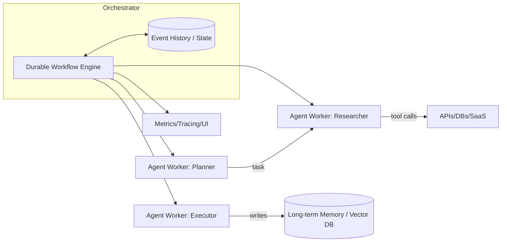

# Выбор агентных харнесов, фреймворков, систем оркестрации и памяти для agent-based приложений

## Исполнительное резюме

Рынок «agent-based» приложений складывается из нескольких слоёв, которые часто смешиваются в одном инструменте: **логика агента (planning/acting/tool-calls)**, **оркестрация (циклы, ветвления, ретраи, durable execution)**, **память и состояние (короткая/долгая, извлечение, персистентность)**, **продакшн-эксплуатация (наблюдаемость, безопасность, деплой, стоимость)**. На практике правильнее выбирать не «один фреймворк», а **конструкцию из 3–5 компонентов** с чёткими границами. Это уменьшает lock-in, облегчает тестирование и миграции.

Ключевой архитектурный водораздел: **in-process orchestration** против **durable orchestration**. Библиотечные агент-фреймворки (LangChain / LlamaIndex / Haystack) дают самый быстрый путь к прототипу и удобную экосистему интеграций (например, LangChain подчёркивает единый API поверх провайдеров и большое число интеграций) citeturn8search4turn8search0, но надёжность long-running задач и повторяемость исполнения обычно приходится строить отдельным слоем (воркеры, очереди, WF-движок, идемпотентность). Durable-движки (Temporal) изначально обеспечивают персистентное исполнение и восстановление по истории событий, что лучше подходит для «длинных» бизнес-процессов и контролируемой отказоустойчивости citeturn12view0turn3search4turn3search0.

По «памяти» важно разделять: **рабочая память (контекст диалога/треда)**, **долгосрочная память (векторная/гибридная база, политики TTL, персистентность)** и **операционное состояние (state машины/воркфлоу)**. Векторные БД (Weaviate / Milvus) и «developer-first» хранилища (Chroma) по-разному балансируют масштаб, функциональность поиска (гибрид, фильтры), безопасность (RBAC/TLS), наблюдаемость (Prometheus/OpenTelemetry), и операционные затраты citeturn6search0turn7search9turn15search1turn15search12turn18search0turn18search2.

Если нужен **быстрый старт**: чаще всего выигрывают LangChain или LlamaIndex + Chroma (локально/embedded) и постепенное усиление до Milvus/Weaviate при росте нагрузки citeturn9view1turn9view2turn2search11turn11view2. Если нужен **продакшн для многошаговых/долгих процессов** с жёсткими требованиями к ретраям/идемпотентности/восстановлению — Temporal как «позвоночник» оркестрации, а агент-фреймворк как библиотека внутри воркеров citeturn12view0turn12view2. Для **масштабирования вычислений и сервинга** (параллелизм, GPU, batching) полезны Ray и/или BentoML (в зависимости от того, чему вы доверяете как runtime) citeturn10view1turn13search4turn10view3turn16search2turn17search2. Для **пакетных ETL/cron/DAG**-процессов остаётся сильным Airflow, но его модель не про низкую латентность и не про «durable agent loops» citeturn3search1turn16search3turn13search8.

Важная свежая деталь: AutoGen помечен как **maintenance mode**; сам проект рекомендует новым пользователям начинать с Microsoft Agent Framework и даёт руководство по миграции citeturn9view0turn5search11.

## Определения и границы понятий

Ниже — практичные определения, которые помогают «разложить» стек и не путать инструменты между собой.

**Agent harness (харнес агента)** — операционная «обвязка», которая превращает агентный код в управляемую систему: контроль запуска/остановки и лимитов, трейсинг и наблюдаемость, тесты/бенчмарки, управление конфигурацией, секретами, ретеншеном логов/трасс, часто — деплой и run-тайм для long-running задач. Примеры признаков харнеса: встроенные eval/observability/bench-инструменты (AutoGen Bench описывает повторяемые прогоны сценариев в контролируемых условиях) citeturn13search0turn13search3; платформенный слой наблюдаемости и evaluation (LangSmith позиционирует observability и evaluation как части полного жизненного цикла) citeturn14search0turn14search1turn14search23.

**Agent framework (агентный фреймворк)** — библиотека/SDK для построения агентной логики: абстракции сообщений, tool calling, циклы «подумай → вызови инструмент → обработай» (например, LangChain описывает агентов как систему, которая умеет делать последовательные/параллельные tool calls и сохранять состояние между ними) citeturn5search4turn5search12. Некоторые фреймворки акцентируют multi-agent общение (AutoGen документирует multi-agent conversation framework) citeturn5search3turn9view0. Важно: фреймворк почти всегда **не равен** продакшн-оркестратору.

**Workflow system (система воркфлоу/оркестрации)** — движок и модель исполнения задач/процессов: DAG/графы, расписания, ретраи, распределение задач по воркерам, наблюдаемость, иногда — event-sourcing и детерминированное воспроизведение. Airflow определяет DAG как модель, включающую расписание, задачи и зависимости citeturn3search1turn16search3. Temporal описывает durable execution через Workflows/Activities и хранение Event History, позволяющее переживать сбои citeturn12view0turn3search4turn3search0. Prefect — оркестратор Python-пайплайнов с мониторингом и ретраями задач/флоу citeturn11view3turn3search10turn3search14.

**Memory system (система памяти)** — слой хранения и извлечения состояния, используемого агентом: от «короткой памяти» диалога до долгосрочной семантической памяти и профилей. Здесь полезно разделить:
- **Short-term / thread memory**: хранение состояния треда и последних ходов (LangChain говорит о short-term memory через checkpointer и thread-level persistence) citeturn5search16.
- **Agent memory API**: интерфейс put/get и настраиваемые реализации (LlamaIndex описывает память агента как компонент с `memory.put()` и `memory.get()`) citeturn5search1.
- **Long-term semantic memory**: векторный индекс/БД, гибридный поиск, фильтры, политики TTL, мульти-тенантность, RBAC (Weaviate подчёркивает гибридный поиск и RBAC в доках) citeturn6search0turn15search1.
- **Retrieval pipelines**: выбор извлекателя, rerank, citations/provenance. Концептуальная база RAG — сочетание параметрической памяти модели и непараметрической памяти (dense index), как в классической работе Lewis et al. citeturn4search0turn4search4.

## Критерии оценки и типовые компромиссы

Ниже — «каркас» оценки. Я намеренно формулирую критерии так, чтобы ими можно было пользоваться и для open-source, и для SaaS/managed вариантов.

### Архитектура и границы ответственности

Архитектурный вопрос №1: **где живёт цикл агента** (agent loop) и **как он переживает сбои**.
- **In-process loop** (внутри одного сервиса/воркера). Плюсы: минимальная латентность и проще дебажить. Минусы: если процесс упал, нужен внешний механизм восстановления и идемпотентность инструментов.
- **Durable loop** (workflow engine). Плюсы: персистентное исполнение и восстановление. Temporal прямо описывает выполнение Workflows «в устойчивой манере» с обработкой сбоев и ретраями citeturn12view0turn3search4. Минус: цена в сложности и в «детерминизме»/ограничениях модели кода (у Temporal целая документация про Event History и replay-недетерминизм) citeturn3search16turn3search4.

Архитектурный вопрос №2: **где хранится состояние**.
- «Состояние диалога» (chat history), «операционное состояние» (state machine), «память знаний» (vector store) — это разные вещи и часто требуют разных хранилищ.
- Хорошая практика: **явно разделять**: (a) state воркфлоу, (b) chat-store, (c) vector DB/документное хранилище.

### Масштабирование, латентность, throughput

Для agent-based систем полезно оценивать латентность по цепочке:
1) pre-processing/маршрутизация,
2) retrieval (вектор/гибрид),
3) rerank,
4) LLM inference (часто доминирует),
5) tool calls (внешние API),
6) пост-обработка и стриминг.

На уровне инфраструктуры:
- Ray позиционируется как единый фреймворк для масштабирования Python/AI приложений от ноутбука до кластера и имеет базовые примитивы (tasks, actors) citeturn3search7turn10view1.
- Для serving’а Ray Serve описывает оптимизации под LLM (streaming, dynamic batching, multi-node/multi-GPU) citeturn13search4.
- BentoML ориентируется на модельный serving и прямо упоминает оптимизации вроде динамического batching и оркестрации inference-графов; документация отдельно описывает adaptive batching citeturn10view3turn16search2.

### Надёжность, fault tolerance, state consistency

- Temporal хранит Event History на весь жизненный цикл workflow execution и подчёркивает, что история — durable и переживёт падение сервиса citeturn3search4turn3search0. При этом есть лимиты на размер истории (важно для «болтливых» агентов) citeturn3search0.
- Airflow и Prefect дают retry/observability, но модель чаще про задачи и планирование, а не про детерминированный «журнал событий» long-running процессов (Prefect описывает задачи как retryable units of work) citeturn3search14turn11view3.

### Security, privacy, compliance

Слой безопасности обычно разный по классам инструментов:
- Агентные фреймворки — библиотека в вашем приложении; безопасность в основном ваша ответственность (секреты, сетевые политики, фильтрация логов).
- Базы памяти и workflow-движки — отдельные сервисы, где важны TLS, auth, RBAC, аудит, изоляция тенантов.

Факты «по месту»:
- Weaviate документирует RBAC и модель авторизации citeturn15search1turn15search9.
- Milvus документирует TLS (шифрование в транзите) и отдельно user authentication/RBAC citeturn15search12turn15search4turn15search8.
- Temporal документирует security для self-hosted и для Cloud; Temporal Cloud различает TLS и mTLS как метод аутентификации, а также описывает сертификаты citeturn15search3turn15search11turn15search7.
- Chroma документирует наличие аутентификации в client-server режиме и отсутствие её в embedded режиме citeturn15search2.

### Наблюдаемость и управляемость

В продакшне оценивать нужно не только «есть ли метрики», но и:
- корреляция: trace/span IDs,
- cardinality,
- возможность исключить/анонимизировать PII,
- наличие UI для run-level дебага,
- стоимость хранения трейсинга.

Примеры:
- Weaviate: Prometheus-совместимые метрики и рекомендации Prometheus/Grafana citeturn17search3.
- Milvus: отдельная документация по monitoring framework (Prometheus+Grafana) citeturn18search0.
- Chroma: observability через OpenTelemetry (tracing/logging/metrics) citeturn18search2turn18search6.
- Ray: dashboard и инструкции по метрикам/Prometheus+Grafana citeturn17search4turn17search5turn17search1.
- Airflow: UI описан как основной интерфейс для инспекции DAG runs и состояний задач citeturn13search2turn13search8.

### Extensibility, интеграции, API, языки, деплой

- LangChain подчёркивает unified API поверх провайдеров моделей и большой набор интеграций citeturn8search4turn8search0turn8search12.
- LlamaIndex отдельно перечисляет интеграции для LLM и vector stores citeturn8search1turn8search5.
- Haystack описывает модель интеграций (дефолтные + партнёрские/комьюнити), и имеет отдельный репозиторий core integrations citeturn8search2turn8search6.
- Weaviate явно описывает API (REST, GraphQL, gRPC) citeturn7search8turn7search4.
- Milvus quickstart указывает REST и gRPC и набор языков клиентов citeturn7search9.
- BentoML описывает упаковку сервисов в «Bento» и containerize как OCI-compliant image citeturn7search7turn7search19.

## Сравнение популярных проектов

Ниже — сравнительный «срез» по 12 распространённым проектам. В таблице я deliberately использую компактные значения и иногда «оценку автора» (qualitative) — потому что абсолютные цифры latency/throughput зависят от модели, промптов, retrieval стратегии, профиля нагрузки и инфраструктуры. Там, где утверждение фактическое (лицензия, режим поддержки, наличие RBAC/TLS, API, формулировки архитектуры) — я привязываюсь к официальным источникам.

### Сводная сравнительная таблица

Обозначения:
- **Тип**: AF=agent framework, WF=workflow system, RT=distributed runtime, SV=serving, VS=vector store/DB.
- **Архитектура**: Lib (встраиваемая библиотека), Server (сервис), Engine (durable/WF engine), Hybrid (и то, и то).
- **Масштаб**: S=single node, H=горизонтальное масштабирование, C=кластер/мульти-ноды.
- **Надёжность/FT** (qual): Low/Med/High как «насколько инструмент сам по себе решает durable execution & recovery».
- **Наблюдаемость**: UI/метрики/OTel по докам.
- **Безопасность**: наличие явной поддержки TLS/auth/RBAC в продукте (не считая «за прокси»).

| Проект | Тип | Архитектура | Языки (основные) | Deployment варианты | API/интеграции | LLM support | State & memory | Персистентность/извлечение | Масштаб | Латентность/Throughput (ожид.) | Надёжность/FT | Observability | Security & privacy | Зрелость/активность | Лицензия |
|---|---|---|---|---|---|---|---|---|---|---|---|---|---|---|---|
| LangChain | AF (+экосистема) | Lib | Python, JS/TS citeturn9view1 | self-host как часть app; экосистема включает LangSmith deployment citeturn9view1turn14search5 | 1000+ интеграций; unified API для провайдеров citeturn8search0turn8search4 | много провайдеров через provider packages citeturn8search12 | memory как концепт; агенты с persistence across tool calls; short-term через checkpointer citeturn5search0turn5search4turn5search16 | retrieval через интеграции (vector stores и др.) (часто внешние VS) citeturn8search0 | S/H (зависит от вашего рантайма) | низкий оверхед библиотеки; доминирует LLM/IO | Low–Med (зависит от внешнего WF/infra) | через LangSmith (tracing/evals) citeturn14search0turn14search1 | в основном на вас; чувствительны логи/PII | active OSS; экосистема продуктов citeturn9view1 | MIT citeturn9view1 |
| LlamaIndex | AF/данные+агенты | Lib | Python (+TS) citeturn9view2turn5search17 | self-host; есть enterprise платформа LlamaParse/Parse citeturn9view2 | модульные интеграции; vector stores как точки интеграции citeturn8search5turn9view2 | список LLM интеграций (OpenAI/Anthropic/Google/… ) citeturn8search1 | memory put/get; chat stores; stateful chat engines citeturn5search1turn5search5turn5search9 | retrieval ориентирован на RAG; интеграции с VS citeturn8search5turn4search0 | S/H (через ваш рантайм/VS) | низкий оверхед библиотеки; доминирует LLM/VS | Low–Med | зависит от вашей обвязки | на вас (как библиотека); enterprise опции отдельно | active, широкий набор пакетов интеграций citeturn9view2turn8search9 | MIT citeturn0search1turn9view2 |
| Haystack | AF (RAG/agents) | Lib | Python citeturn10view0 | self-host; есть enterprise платформа (HPE) | directed multigraph pipelines; интеграции выведены в отдельный repo citeturn5search6turn8search6 | vendor-agnostic (провайдеры перечислены в README) citeturn10view0 | агентная модель + pipelines; прозрачная архитектура retrieval/memory/generation citeturn10view0turn5search2turn5search6 | retrieval через pipeline-компоненты и document stores | S/H (через infra) | низкий оверхед библиотеки; throughput зависит от runtime | Low–Med | трассинг/метрики — через вашу обвязку; есть telemetry секция citeturn10view0 | как библиотека — на вас; enterprise может добавлять контроли | активный OSS; docs и breaking change policy citeturn10view0turn8search22 | Apache-2.0 citeturn0search2turn10view0 |
| AutoGen | AF (multi-agent) | Lib (+инструменты) | Python (+упоминание .NET поддержки в Core API) citeturn9view0 | self-host; есть Studio (no-code) citeturn9view0 | multi-agent chat framework; Extensions API citeturn9view0turn5search3 | через extensions (OpenAI/AzureOpenAI в примерах) citeturn9view0 | фокус на multi-agent patterns (GroupChat и т.п.) citeturn5search3turn5search11 | зависит от подключённых stores | S/H (через infra) | зависит от реализации; прототипирование быстро | Low–Med | есть AutoGen Bench (benchmark suite) citeturn13search0turn13search3 | требуется своя prod security; есть security note; важное: maintenance mode citeturn9view0turn5search7 | **maintenance mode**; рекомендуют миграцию citeturn9view0turn5search11 | MIT (code) citeturn0search19turn9view0 |
| Ray | RT (distributed) | Engine/RT | Python (ядро) citeturn10view1turn3search7 | laptop→cluster→Kubernetes citeturn10view1 | tasks/actors/objects; есть Serve/Dashboard citeturn3search7turn17search4 | сам по себе не LLM-фреймворк, но служит базой для LLM workloads/serving citeturn13search4 | stateful actors как модель состояния citeturn3search3turn3search19 | не «память» как VS; state нужно хранить отдельно | C/H | хорош для throughput/параллелизма; latency зависит от распределения | Med (устойчивость на уровне runtime, но не durable бизнес-процесс) | Dashboard; Prometheus metrics; интеграции citeturn17search4turn17search5turn17search1 | security в основном на уровне кластера/сети | active, большой стек библиотек citeturn10view1 | Apache-2.0 citeturn1search0turn10view1 |
| Prefect | WF | Hybrid (Lib+Server) | Python citeturn11view3turn3search14 | self-host server или Prefect Cloud citeturn11view3turn16search10 | flows/tasks; retries; event-based automations citeturn11view3turn3search10turn3search14 | не про LLM напрямую, но подходит как orchestrator | состояние — через run state; задачи retryable citeturn3search14turn3search2 | персистентность зависит от backend Prefect Server/Cloud | H (через воркеры) | overhead выше, чем in-process; не для ultra-low-latency | Med | UI+мониторинг в реальном времени citeturn16search1turn11view3 | security зависит от self-host/Cloud; требует настройки | active; миграционные гайды (Airflow→Prefect) citeturn3search2 | Apache-2.0 citeturn1search1turn11view3 |
| Temporal | WF (durable) | Engine (durable) | multi-SDK; server на Go citeturn12view0turn12view2 | self-host или Temporal Cloud citeturn12view2turn8search11 | workflows/activities; event history; retry semantics citeturn12view0turn3search4turn3search0 | не LLM-фреймворк; хорош как backbone для agent workflows | state через детерминированный workflow + history | history durable; limits по event history важны citeturn3search0turn3search4 | C/H | overhead выше, но даёт «гарантии» и восстановление | **High** (встроенная durable execution) citeturn12view0turn3search4 | Web UI; метрики (Prometheus/OpenMetrics в Cloud) citeturn12view0turn18search3turn18search15 | security docs (self-host), TLS/mTLS (Cloud) citeturn15search3turn15search11 | mature; частые релизы citeturn12view0turn8search23 | MIT citeturn1search2turn12view0 |
| Airflow | WF (DAG, batch) | Engine/Server | Python citeturn13search8turn3search1 | от single-process до distributed citeturn13search8turn16search0 | DAGs: schedule/tasks/dependencies citeturn3search1turn3search9 | не LLM-фреймворк; годится для batch ingestion/ETL (RAG ingestion) | state в метаданных и состояниях задач/DAG runs | персистентность задач через метаданные Airflow | H/C | ориентирован на batch; латентность секунд/минут (планировщик) citeturn16search3 | Med | мощный UI для мониторинга/дебага citeturn13search2turn13search8 | security модель зависит от конфигурации | зрелый Apache-проект citeturn10view2turn1search3 | Apache-2.0 citeturn1search3turn10view2 |
| BentoML | SV (serving) | Hybrid (Lib+tooling) | Python citeturn10view3turn7search7 | local, Docker/OCI, Kubernetes; BentoCloud citeturn10view3turn7search19turn7search3 | REST API, packaging; интеграция с vLLM упоминает OCI+K8s citeturn7search19turn6search7 | LLM serving через backends (vLLM и др.) citeturn6search7turn17search22 | не “память”; состояние обычно внешнее | persistence/VS — внешние | H/C (через контейнеры/оркестратор) | оптимизации throughput (batching) citeturn16search2 | Med (как serving слой) | метрики через prometheus_client citeturn17search2 | security зависит от окружения; endpoints нужно защищать | активный OSS | Apache-2.0 citeturn2search0turn10view3 |
| Weaviate | VS (vector DB) | Server | Go (+клиенты) citeturn11view0turn7search8 | self-host; Weaviate Cloud/Agents docs citeturn2search13turn7search8 | REST + GraphQL + gRPC citeturn7search8turn7search4 | модель-провайдеры через модули/интеграции (зависит от setup) | long-term memory: объекты+вектора; TTL; multi-tenancy упомянуты в repo citeturn11view0 | hybrid search (BM25F + vector) citeturn6search0turn6search4 | C/H | подходит для низкой латентности retrieval при верной индексации | Med–High (как DB) | Prometheus-метрики citeturn17search3turn17search11 | RBAC и authn/authz docs citeturn15search1turn15search9 | активный, частые релизы citeturn11view0 | BSD-3-Clause citeturn2search1turn11view0 |
| Milvus | VS (vector DB) | Server | Go/C++ (+клиенты) | self-host; managed через Zilliz Cloud citeturn11view1turn2search10 | REST+gRPC; клиенты Python/Java/Go/C#/Node citeturn7search9 | не про LLM напрямую; используется как память RAG | long-term memory: ANN search | индексы HNSW/IVF/PQ и др.; docs объясняют trade-offs citeturn6search13turn6search1turn6search5 | C/H | ориентирован на high-perf ANN | Med–High | monitoring framework Prometheus+Grafana citeturn18search0turn18search8 | TLS + auth + RBAC docs citeturn15search12turn15search4turn15search8 | зрелый проект, под эгидой LF AI & Data citeturn11view1 | Apache-2.0 citeturn2search2turn11view1 |
| Chroma | VS (vector store) | Hybrid (embedded+server) | Python + JS + Go + Docker (доки) citeturn11view2turn7search18 | local/embedded; server; Chroma Cloud citeturn2search11turn11view2 | HTTP client для production; docs рекомендуют async http client citeturn7search6 | не про LLM напрямую; применяется как память | long-term memory (малые/средние); embedded быстро | full-text и hybrid search (RRF) в доках citeturn6search2turn6search10turn6search18 | S/H (Cloud/Server) | часто хорош для DX; масштаб зависит от режима | Med | observability через OpenTelemetry; distinction telemetry vs observability citeturn18search2turn18search6 | auth доступен в client-server; нет auth в embedded citeturn15search2 | активный, есть Cloud | Apache-2.0 citeturn2search3turn11view2 |

### Официальные ссылки на документацию и репозитории

```text
LangChain
- Repo: https://github.com/langchain-ai/langchain
- Docs: https://docs.langchain.com/

LlamaIndex
- Repo: https://github.com/run-llama/llama_index
- Docs: https://developers.llamaindex.ai/

Haystack
- Repo: https://github.com/deepset-ai/haystack
- Docs: https://docs.haystack.deepset.ai/

AutoGen
- Repo: https://github.com/microsoft/autogen
- Docs: https://microsoft.github.io/autogen/

Ray
- Repo: https://github.com/ray-project/ray
- Docs: https://docs.ray.io/

Prefect
- Repo: https://github.com/PrefectHQ/prefect
- Docs: https://docs.prefect.io/

Temporal
- Repo: https://github.com/temporalio/temporal
- Docs: https://docs.temporal.io/

Airflow
- Repo: https://github.com/apache/airflow
- Docs: https://airflow.apache.org/docs/

BentoML
- Repo: https://github.com/bentoml/BentoML
- Docs: https://docs.bentoml.com/

Weaviate
- Repo: https://github.com/weaviate/weaviate
- Docs: https://docs.weaviate.io/

Milvus
- Repo: https://github.com/milvus-io/milvus
- Docs: https://milvus.io/docs/

Chroma
- Repo: https://github.com/chroma-core/chroma
- Docs: https://docs.trychroma.com/
```

### Короткие заметки по каждому проекту

#### LangChain
LangChain — библиотечный фреймворк для построения LLM-приложений и агентов и одновременно «экосистема», в которой отдельно фигурируют LangGraph (контролируемые agent workflows) и LangSmith (observability/evals/deployment) citeturn9view1turn14search23turn14search5.

Сильные стороны: большой слой интеграций и единый интерфейс к провайдерам; агентные абстракции и tool calling; развитая платформа наблюдаемости и оценки качества (LangSmith) citeturn8search0turn8search4turn14search0turn14search1. Слабые стороны: в «чистом виде» не даёт durable execution; безопасность/комплаенс и государственное управление данными зависят от вашей архитектуры. Типовые use cases: прототипирование, conversational agents, RAG, tool-using агенты; в проде часто комбинируется с отдельным workflow engine для долгих процессов. Зрелость: активный OSS и активная продуктовая линия citeturn9view1. Лицензия: MIT citeturn9view1.

#### LlamaIndex
LlamaIndex позиционируется как open-source фреймворк для agentic приложений и «data framework» с большим числом интеграционных пакетов citeturn9view2turn8search9. Документация явно раскрывает memory API (put/get), chat engines как stateful интерфейс, и интеграции с vector stores citeturn5search1turn5search5turn8search5.

Сильные стороны: сильный фокус на данных, ingestion и RAG, множество коннекторов; явные абстракции памяти и chat-слоя. Слабые: как библиотека нуждается в продакшн-обвязке (наблюдаемость, ретраи внешних инструментов, деплой). Use cases: RAG чат-боты, «chat with your data», document agents. Зрелость: активный проект; есть enterprise платформа вокруг parsing/OCR/деploy агента citeturn9view2. Лицензия: MIT citeturn0search1turn9view2.

#### Haystack
Haystack — Python-фреймворк «AI orchestration» с прозрачной моделью pipeline/agent workflows и вынесенными в отдельный репозиторий интеграциями citeturn10view0turn8search6turn5search6.

Сильные стороны: «явная» архитектура пайплайнов (directed multigraph), удобна для production RAG (контроль retrieval/routing); vendor-agnostic модель и развитая экосистема интеграций citeturn10view0turn8search2. Слабые: для long-running/durable бизнес-процессов обычно нужен отдельный workflow engine; наблюдаемость зависит от вашей инфраструктуры. Use cases: production RAG, поисковые/семантические системы, агенты с прозрачными retrieval цепочками. Лицензия: Apache-2.0 citeturn0search2turn10view0.

#### AutoGen
AutoGen — multi-agent framework, но в репозитории явно указан **maintenance mode** и рекомендация начинать новые проекты с Microsoft Agent Framework; есть migration guide citeturn9view0turn5search11. AutoGen предлагает Core API (message passing, event-driven agents, runtime) и AgentChat API для быстрого прототипирования; также есть Studio и Bench citeturn9view0turn13search0.

Сильные стороны: сильные multi-agent паттерны и экосистемные инструменты (bench/studio). Слабые: режим поддержки (без новых фич), продакшн-требования по security/auth нужно строить самостоятельно (в README есть прямое предупреждение) citeturn9view0. Use cases: исследования multi-agent, быстрое прототипирование групповых чатов, сравнение подходов через Bench. Лицензия: MIT (code) citeturn0search19turn9view0.

#### Ray
Ray — распределённый runtime с примитивами tasks/actors/objects и экосистемой библиотек; официальные docs подчёркивают задачи и акторы как базовые концепты, а README — масштабирование Python/AI от ноутбука до кластера и Kubernetes citeturn3search7turn10view1turn10view1. Ray Dashboard и Prometheus-метрики документированы для наблюдаемости citeturn17search4turn17search5.

Сильные стороны: throughput/параллелизм, удобен как «вычислительный слой» для агентов, особенно когда есть много tool calls/сабтасков, и когда надо эксплуатировать GPU/кластер. Слабые: не заменяет durable workflow engine (state consistency и recovery бизнес-процессов остаются на вас). Use cases: параллельная обработка документов для ingestion, распределённые агенты, LLM serving через Ray Serve citeturn13search4. Лицензия: Apache-2.0 citeturn1search0turn10view1.

#### Prefect
Prefect — workflow orchestrator для Python: flow/task, расписания, retries, мониторинг через UI, self-hosted server или managed Cloud citeturn11view3turn16search10turn16search1. Документация и примеры подчёркивают retry и наблюдаемость citeturn3search10turn3search14turn16search7.

Сильные стороны: удобство для data/automation потоков, гибкость динамического исполнения, UI и простота «поднять сервер и смотреть графы» citeturn16search1turn11view3. Слабые: не даёт того же класса durable execution семантики, что Temporal; не предназначен для ultra-low-latency контуров. Use cases: ingestion pipeline для RAG, периодические jobs, ETL/ELT, бэкграундные агентные задания. Лицензия: Apache-2.0 citeturn1search1turn11view3.

#### Temporal
Temporal — durable execution платформа: README подчёркивает «resilient execution», автоматическую обработку intermittent failures и retries citeturn12view0. Документация объясняет Event History как устойчивый журнал, переживающий сбои citeturn3search4turn3search0. Есть выбор self-host или Temporal Cloud citeturn12view2turn8search11.

Сильные стороны: гарантии исполнения long-running процессов, детерминированные replay-тесты, сильный контроль над ретраями и состоянием; подходит как «скелет» для агентных бизнес-процессов. Слабые: усложняет архитектуру и накладывает дисциплину детерминированного workflow-кода; нужно следить за ростом Event History (лимиты) citeturn3search0turn3search16. Use cases: многошаговые агентные процессы, оркестрация multi-agent как набор workflow/activities, интеграции с внешними системами с идемпотентностью. Лицензия: MIT citeturn12view0turn1search2.

#### Airflow
Airflow — оркестратор batch-oriented workflows; documentation определяет DAG как модель со schedule/tasks/dependencies и описывает scheduler, который мониторит задачи/даги и триггерит task instances citeturn3search1turn16search3turn13search8. UI — основной интерфейс для диагностики DAG runs и состояний задач citeturn13search2.

Сильные стороны: зрелая модель для batch и расписаний, огромная экосистема операторов/провайдеров, сильный UI. Слабые: не предназначен для «живых» agent loops с низкой латентностью; модель планировщика (по умолчанию циклы раз в минуту) не про реалтайм citeturn16search3. Use cases: ingestion/ETL для RAG, ночные/периодические пайплайны, backfills. Лицензия: Apache-2.0 citeturn1search3turn10view2.

#### BentoML
BentoML — serving для AI/ML: README описывает упаковку и деплой через Docker и BentoCloud, упоминает оптимизации inference (dynamic batching) citeturn10view3turn16search2. Документация описывает «Bentos» как стандартный формат packaging и `bentoml containerize` как OCI-compliant image builder citeturn7search7turn7search19. Есть справка по метрикам через Prometheus client citeturn17search2.

Сильные стороны: быстро делает из inference кода управляемый сервис; помогает с контейнеризацией, batching и scaling; подходит для LLM-serving в связке с backends (пример с vLLM) citeturn6search7turn17search22. Слабые: не решает оркестрацию агентных процессов и «память» сама по себе. Use cases: production API для модели/агента, сервисы embedder/reranker, inference pipelines. Лицензия: Apache-2.0 citeturn10view3turn2search0.

#### Weaviate
Weaviate — vector DB с REST/GraphQL/gRPC API citeturn7search8turn7search4, гибридным поиском (BM25F + vector fusion) citeturn6search0turn6search4 и документацией по RBAC citeturn15search1turn15search9. Есть Prometheus metrics для мониторинга citeturn17search3.

Сильные стороны: богатая функциональность retrieval (гибрид, операторы), безопасность и многопользовательский режим (RBAC) как часть продукта, зрелая эксплуатация. Слабые: как полноценная БД требует операционных усилий (кластер, обновления, capacity planning). Use cases: long-term memory/knowledge base, RAG на больших объёмах, hybrid search. Лицензия: BSD-3-Clause citeturn11view0turn2search1.

#### Milvus
Milvus — cloud-native vector DB для ANN search; README упоминает, что проект под эгидой LF AI & Data Foundation, и что есть managed вариант на Zilliz Cloud citeturn11view1turn2search10. Документация описывает индексы (HNSW, IVF_PQ) и trade-offs память/латентность citeturn6search13turn6search1turn6search5, а также security (TLS, auth, RBAC) citeturn15search12turn15search4turn15search8 и мониторинг (Prometheus/Grafana) citeturn18search0turn18search8.

Сильные стороны: производительность и масштаб для больших векторных коллекций, развитые индексы, продакшн-эксплуатация. Слабые: сложнее, чем «легковесные» варианты; требует грамотного выбора индекса и параметров. Use cases: высоконагруженный retrieval, long-term memory, большие RAG базы. Лицензия: Apache-2.0 citeturn2search2turn11view1.

#### Chroma
Chroma — «developer-first» векторное хранилище: поддержка embedded режима и client-server, простой API; репозиторий прямо показывает, что есть Python и JS клиенты и команда `chroma run` для server mode citeturn11view2. Документация фиксирует Apache-2.0 и наличие managed Chroma Cloud citeturn2search11turn11view2. Есть hybrid search и full-text возможности (в доках) citeturn6search18turn6search10, observability через OpenTelemetry citeturn18search2turn18search6 и документация по authentication для client-server режима citeturn15search2.

Сильные стороны: скорость прототипирования, «встроить в приложение» без отдельного кластера, понятная эксплуатация на малых объёмах. Слабые: embedded режим без аутентификации; масштабирование и enterprise-контроли обычно лучше закрывают полноценные БД. Use cases: прототипы RAG, небольшие memory базы, дев/стейдж окружения.

## Подбор решений по сценариям и decision flow

### Практические критерии выбора по use case

**Прототипирование (days–weeks, быстрые итерации)**
- Что важно: DX, простые интеграции, быстрый старт, минимальная инфраструктура.
- Типовой стек: LangChain или LlamaIndex как агент-фреймворк citeturn9view1turn9view2 + Chroma embedded/server citeturn11view2turn2search11. Для наблюдаемости качества — быстро подключать трейсинг/evals (LangSmith как пример платформенного слоя) citeturn14search0turn14search1.

**Production conversational agents (SLA, мониторинг, безопасные tool calls)**
- Что важно: наблюдаемость «по траектории агента», контроль tool calls, стейт тредов, защита PII, стабильные интеграции.
- Типовой стек: LangChain + short-term memory/checkpointing citeturn5search16turn5search4 + векторная БД для долговременной памяти (Weaviate/Milvus; Chroma для меньших масштабов) citeturn6search0turn6search13turn11view2. Для продакшн-оркестрации долгих задач — выносить фоновые процессы в WF engine (Temporal/Prefect) citeturn12view0turn11view3.

**Multi-agent orchestration (координация ролей, group chat, распределение задач)**
- Что важно: модель коммуникации (agents-as-actors vs agents-as-workflows), управление состоянием группы, повторяемость, политика остановки, дебаг.
- Если цель — research/прототип: AutoGen удобен, но учесть maintenance mode и план миграции citeturn9view0turn5search11.
- Для продакшна: чаще полезнее сделать «роль агентов» как activities/workers под контролем Temporal (durable orchestration) citeturn12view0turn3search4, а multi-agent логику оставить в коде библиотечного фреймворка.

**RAG pipelines (ingestion + retrieval + generation)**
- Что важно: качество retrieval (hybrid/rerank), воспроизводимость ingestion, наблюдаемость, способность к backfill.
- Для быстрого RAG: LlamaIndex или Haystack (оба ориентированы на retrieval/pipelines) citeturn8search5turn5search6turn10view0.
- Для ingestion по расписанию: Airflow (DAG и scheduler) citeturn3search1turn16search3 или Prefect. Retrieval memory: Weaviate (hybrid) citeturn6search0 или Milvus (индексы и масштаб) citeturn6search13turn6search1.

**Long-term memory (персонализация, профили, знания, “evergreen” память)**
- Что важно: персистентность, ACL/RBAC, аудит, multi-tenancy, TTL/retention, гибридный поиск.
- Weaviate: RBAC + hybrid search + Prometheus мониторинг citeturn15search1turn6search0turn17search3.
- Milvus: TLS/auth/RBAC + развитые индексы + Prometheus/Grafana citeturn15search12turn15search8turn18search0turn6search13.
- Chroma: удобно, но security и масштаб нужно оценивать по режиму (embedded vs server) citeturn15search2turn11view2.

**Real-time control (низкая латентность, реактивное управление, event-driven)**
- Что важно: p95/p99 latency, предсказуемость, управление параллелизмом, backpressure, безопасность tool calls.
- Обычно избегают тяжёлых DAG-движков как «внутреннего цикла». Ray actors хорошо подходят как модель stateful workers citeturn3search3turn3search19. Для inference/serving — Ray Serve или BentoML (batching/streaming) citeturn13search4turn16search2.
- Для «долгих» компенсирующих транзакций поверх real-time контура — отдельный durable workflow (Temporal) citeturn12view0turn3search4.

### Рекомендуемый decision flow / чеклист выбора

Ниже — практическая последовательность, которая обычно отсекает 70–80% неопределённости.

1) **Определите тип работы:** интерактивный чат/реалтайм или batch/фон. Airflow прямо ориентирован на batch-oriented workflows citeturn13search8 — это хороший «флажок», что для realtime-агентов он редко оптимален.

2) **Нужна ли durable execution семантика?**  
Если процесс может длиться минуты/часы/дни, должен переживать рестарты и иметь воспроизводимость — Temporal как класс решений. Temporal документирует Event History как durable журнал, переживающий сбои citeturn3search4turn3search0.

3) **Где будет состояние?**
- Thread memory (диалог) — нужен ли checkpointer/хранилище (LangChain) citeturn5search16.
- Long-term memory — нужен ли RBAC/multi-tenancy/hybrid search (Weaviate/Milvus) citeturn15search1turn15search8turn6search0.

4) **Какой профиль retrieval?**
- Нужен гибрид (keyword+semantic) — Weaviate hybrid search (BM25F+vector fusion) citeturn6search0turn6search4 или Chroma hybrid search (RRF) citeturn6search2turn6search18.
- Нужен масштаб и выбор ANN индекса — Milvus (HNSW/IVF/PQ и объяснение trade-offs) citeturn6search13turn6search1turn6search5.

5) **Наблюдаемость и eval в продакшне:**
- Хотите «агент-уровневые» трейсы и оценку качества — выделяйте слой харнеса/eval (например, LangSmith описывает observability и evaluation) citeturn14search0turn14search1.
- Для инфраструктурных компонентов: Prometheus/Grafana или OpenTelemetry (Weaviate, Milvus, Chroma, Ray имеют официальные материалы) citeturn17search3turn18search0turn18search2turn17search5.

6) **Security/compliance constraints (PII, ключи, аудит):**
- Если требуется RBAC в memory store — Weaviate/Milvus документационно подтверждают такие механизмы citeturn15search1turn15search8.
- Если требуется mTLS для orchestration слоя — Temporal Cloud описывает mTLS и сертификаты citeturn15search11turn15search7.

### Мини-матрица решений: use cases → топ-3

| Use case | Лучшие 3 (порядок) | Почему именно они |
|---|---|---|
| Прототип агента | LangChain; LlamaIndex; Chroma | Быстрый старт и интеграции (LangChain), сильный data/RAG слой (LlamaIndex), простая память без кластера (Chroma) citeturn8search0turn8search5turn11view2 |
| Продакшн чат + память | LangChain; Weaviate; Milvus | Агентный слой + short-term memory (LangChain); RBAC/hybrid (Weaviate) или масштаб/индексы/TLS(RBAC) (Milvus) citeturn5search16turn6search0turn15search12turn15search8 |
| Multi-agent orchestration | Temporal; LangChain; Ray | Temporal как durable backbone; LangChain для agent/tool логики; Ray для масштабирования параллельных сабтасков citeturn12view0turn5search4turn3search7 |
| RAG pipeline (prod) | Haystack; Milvus; Airflow | Haystack как прозрачный pipeline/agent orchestration; Milvus как high-perf retrieval; Airflow для ingestion/backfills по расписанию citeturn10view0turn6search13turn3search1 |
| Long-term memory/knowledge base | Weaviate; Milvus; Chroma | Weaviate — гибрид+RBAC; Milvus — масштаб+индексы+TLS/RBAC; Chroma — лёгкая альтернатива для меньших объёмов citeturn6search0turn15search1turn6search13turn15search12turn15search2 |
| Реалтайм контур + serving | Ray Serve; BentoML; Temporal | Ray Serve и BentoML про throughput/стриминг/batching; Temporal — для «долгой» компенсации/оркестрации вне realtime цикла citeturn13search4turn16search2turn12view0 |

## Референсные архитектуры

Ниже — три типовых схемы. Идея не в том, что «так надо всегда», а в том, чтобы **явно выделить границы**: где цикл агента, где durable orchestration, где память, где наблюдаемость.

### Простой conversational agent с короткой памятью

```mermaid
flowchart LR
  U[User / Client] --> GW[API Gateway]
  GW --> APP[Agent Service]
  APP -->|prompt + tools spec| LLM[LLM Provider]
  APP -->|tool call| TOOL[External Tool/API]
  TOOL --> APP

  APP --> MEM[Short-term Memory\n(thread store/checkpointer)]
  MEM --> APP

  APP --> OBS[Tracing/Logs/Metrics]
```

Ключевые решения: (1) хранить thread-level state отдельно (checkpointer/DB/Redis), (2) не логировать PII в traces, (3) инструментальные вызовы делать идемпотентными.

### RAG pipeline с vector DB и долгосрочной памятью

```mermaid
flowchart TB
  subgraph Ingestion
    SRC[Docs / DB / Files] --> SPLIT[Chunking + Metadata]
    SPLIT --> EMB[Embedding Model]
    EMB --> VDB[(Vector DB)]
  end

  subgraph QueryTime
    Q[User Query] --> QEMB[Query Embedding]
    QEMB --> RET[Retriever (vector/hybrid)]
    RET --> RERANK[Reranker (optional)]
    RERANK --> CTX[Context Builder]
    CTX --> GEN[LLM Generation]
    GEN --> A[Answer + citations]
  end

  VDB --> RET
  GEN --> OBS[Tracing/Evals/Monitoring]
```

Концептуально это соответствует идее RAG как комбинации параметрической памяти LLM и непараметрической памяти (dense vector index) citeturn4search0turn4search4. Практически ключевые параметры качества — стратегия чанкинга, фильтры, hybrid поиск (где нужен), rerank, и политика обновления индекса.

### Multi-agent workflow + orchestration



Если использовать Temporal-подобный движок, принципиально важны: (a) хранение истории событий, (b) replay тесты и контроль недетерминизма, (c) управление ростом history (лимиты) citeturn3search4turn3search16turn3search0.

## Производительность, стоимость и какие бенчмарки искать

### Где реально «горит» latency и стоимость

1) **LLM inference** (обычно доминирует): токены входа (context) + токены выхода. Стоимость и latency — функция модели, провайдера и режима (streaming, batch).
2) **Tool calls**: внешние API часто дают «хвосты» p95/p99, сетевые таймауты, rate limits.
3) **Retrieval**: латентность запроса к vector DB; влияет индекс (HNSW vs IVF_PQ и др.), размер коллекции и фильтры. Milvus прямо описывает trade-off: HNSW — низкая латентность/высокая точность при большем memory overhead citeturn6search13turn6search9; IVF_PQ — часто экономит память ценой скорости/точности citeturn6search1turn6search5.
4) **Оркестрация**: durable execution добавляет накладные расходы, но покупает guarantees (пример: Event History и recovery).

### Что смотреть в бенчмарках (и чего часто не хватает)

Для **agent frameworks**:
- измерение «end-to-end» с учётом tool calls и retrieval, а не только latency одного LLM запроса;
- стабильность и качество (win rate, task success) на репрезентативных сценариях;
- воспроизводимость условий (фиксация начального состояния, окружения).

AutoGen Bench прямо ориентирован на повторяемые прогоны сценариев в контролируемых условиях citeturn13search0turn13search3. Для production-качества важны также evals и мониторинг качества в реальном времени; LangSmith описывает offline/online evaluation и связку с observability citeturn14search1turn14search7.

Для **vector DB**:
- latency p50/p95/p99 на `topK` и на типовых фильтрах,
- recall@K (если сравниваете ANN индексы),
- скорость ingestion/build index,
- стоимость RAM (особенно для HNSW),
- стабильность при обновлениях/compaction.

Для **serving**:
- токены/сек (throughput) и tail latency,
- эффективность batching (BentoML описывает adaptive batching как механизм, улучшающий throughput и utilization) citeturn16search2,
- холодный старт, масштабирование replicas.

### Рекомендуемые тесты, которые стоит прогнать до выбора

Набор тестов, который обычно окупается за 1–2 недели работы и предотвращает «переезд через 3 месяца».

**Нагрузочные тесты**
- 3 профиля: steady QPS, bursty (пики), long-tail (редкие тяжёлые запросы).
- Метрики: p50/p95/p99 по этапам пайплайна (retrieval, LLM, tools) + общий end-to-end.
- Для Ray Serve/BentoML: тесты с batching on/off и разными max latency windows citeturn13search4turn16search2.

**Тесты отказов**
- принудительные timeouts tool calls,
- падение воркера/пода,
- деградация vector DB (задержки, частичный отказ),
- проверка идемпотентности и повторного исполнения (особенно в WF engine).

**Тесты качества (evaluation)**
- набор golden queries со справочными ответами или критериями,
- измерение hallucination rate и citation correctness,
- A/B сравнение retrieval стратегий (vector vs hybrid vs rerank). Weaviate описывает hybrid search как слияние vector и BM25F результатов citeturn6search0turn6search4 — это типичный кандидат для A/B.

**Тесты стоимости**
- токены на запрос, средний размер контекста,
- стоимость embeddings и хранения,
- стоимость observability (объём логов/трасс; retention).

## Security, compliance, data privacy и миграции

### Security & privacy чеклист (практический)

**Контроль данных**
- Классифицируйте данные (PII/PHI/секреты/коммерческая тайна).
- Определите, что можно отправлять провайдеру модели, а что должно оставаться on-prem.
- Введите политики retention для chat history и vector store.

**Шифрование**
- TLS в транзите между сервисами (особенно к DB/WF engine). Milvus описывает TLS для gRPC и REST traffic citeturn15search12.
- Для managed orchestration — mTLS при необходимости. Temporal Cloud описывает TLS как шифрование и mTLS как метод доказательства идентичности citeturn15search11.

**Аутентификация и авторизация**
- RBAC для long-term memory (Weaviate RBAC overview) citeturn15search1.
- RBAC/auth в Milvus при необходимости tenant isolation citeturn15search8turn15search4.
- Для Chroma: убедитесь, что вы не используете embedded mode там, где нужен auth (доки прямо говорят, что auth только для client-server) citeturn15search2.

**Аудит и наблюдаемость безопасности**
- Логирование решений авторизации (Weaviate упоминает authorization decision logs для RBAC) citeturn15search21.
- Раздельные каналы: security-аудит vs debug-логи (минимизация PII).

**Управление секретами**
- Секреты tool calls и ключи LLM провайдеров хранить в secret manager.
- Rotations + rollback.

**Supply chain**
- pin версий, SBOM, сканирование зависимостей.
- отдельно оценивать лицензии (см. таблицу).

### Observability/комплаенс чеклист

- Метрики: QPS, p95/p99 latency, error rates, retries, token usage.
- Tracing: end-to-end trace по запросу (retrieval + LLM + tools).
- Для инфраструктуры: Prometheus/Grafana стандартно поддерживаются у Weaviate и Milvus citeturn17search3turn18search0; Chroma заявляет OpenTelemetry observability citeturn18search2turn18search6; Ray emits Prometheus-format metrics и имеет dashboard citeturn17search5turn17search4.
- Для Temporal Cloud: экспорт метрик через OpenMetrics endpoint описан в документации citeturn18search3.

### Миграция и интероперабельность

**Как уменьшать lock-in между агент-фреймворками**
- Держите «ядро агента» в виде чистых функций/классов с минимальными зависимостями от конкретного SDK.
- Введите собственные абстракции:
  - `Message` (role/content/metadata),
  - `Tool` (schema, timeouts, retry policy),
  - `Memory` (interface put/get, serialization).
- Тогда смена LangChain ↔ LlamaIndex ↔ Haystack становится миграцией адаптеров, а не переписыванием бизнес-логики. Это особенно важно, потому что «tool calling» — общий паттерн взаимодействия модели и приложения (например, OpenAI описывает flow tool calling как многошаговый диалог application↔model) citeturn4search10.

**Как переключать vector DB**
- Изолируйте слой retrieval:
  - единый контракт «запрос → список документов/чанков + scores + metadata»,
  - отдельные настройки индексации и гибридного поиска.
- Если используете hybrid: переносите логику fusion (RRF/веса) на уровень приложения или выбирайте DB, где это нативно. Weaviate описывает fusing результатов vector и BM25F citeturn6search0turn6search4; Chroma описывает hybrid search с RRF citeturn6search2turn6search18.
- План миграции данных:
  - экспорт embeddings + metadata,
  - переиндексация и валидация recall/latency,
  - параллельный двойной прогон (shadow reads) на период переключения.

**Как переезжать между оркестраторами**
- Отделите definitions процесса (граф) от реализации действий.
- Сведите «действия» к идемпотентным activities/tasks. Это особенно критично для durable engines.
- Следите за ограничениями history/логов. Temporal имеет лимиты на Event History citeturn3search0 — это влияет на дизайн (например, не писать каждый токен в историю).

**Migration tips, когда экосистема “двигается”**
- Учитывайте статусы поддержки. AutoGen помечен как maintenance mode и сам рекомендует миграцию на новый фреймворк citeturn9view0turn5search11. Это сигнал: если вы выбираете AutoGen сегодня, заранее заложите boundary layer и тесты миграции.

## Краткие рекомендации

Если ваша цель — построить агентное приложение «как продукт», чаще всего разумно:

1) Выбирать **agent framework** по DX и интеграциям (LangChain / LlamaIndex / Haystack), а не пытаться решить им надежность и продакшн-эксплуатацию. Это соответствует тому, как сами проекты позиционируют себя: LangChain как фреймворк и экосистема, Haystack как orchestration framework для production RAG/agents citeturn9view1turn10view0.

2) Для **долгих бизнес-процессов** и multi-step задач с требованиями к восстановлению — ставить **Temporal** как backbone и запускать агентную логику в воркерах/activities, используя Event History и replay-подход там, где это критично citeturn12view0turn3search4turn3search16.

3) Для **памяти**:
- Chroma — отличный старт и низкий friction, но учитывайте различие embedded vs server в части authentication citeturn15search2turn11view2.
- При росте и требованиях к безопасности/тенантности — Weaviate (RBAC + hybrid) или Milvus (индексы + TLS/RBAC) citeturn15search1turn6search0turn15search12turn6search13.

4) Для **масштабирования вычислений** и высоких throughput workloads — Ray как distributed runtime, а для serving и batching — Ray Serve и/или BentoML (выбор зависит от того, хотите ли вы unified runtime или специализированный serving слой) citeturn3search7turn13search4turn16search2.

5) В проде не экономить на **observability+eval**: без трасс и систематической оценки качество «агентов» деградирует незаметно. Используйте подходы типа offline/online evaluation и трассинг траекторий (пример позиционирования — LangSmith) citeturn14search1turn14search7turn14search0.

6) При выборе AutoGen закладывать миграцию, потому что проект сам фиксирует maintenance mode и рекомендует переход на новый фреймворк citeturn9view0turn5search11.

